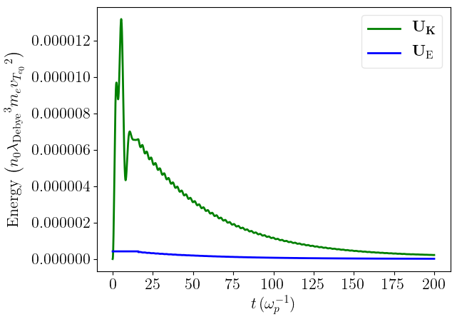
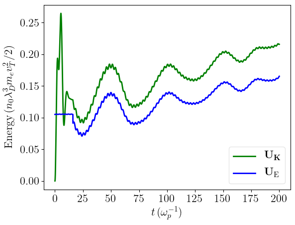
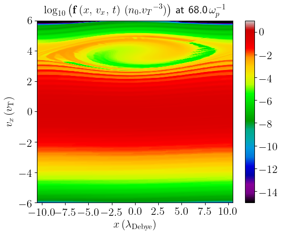
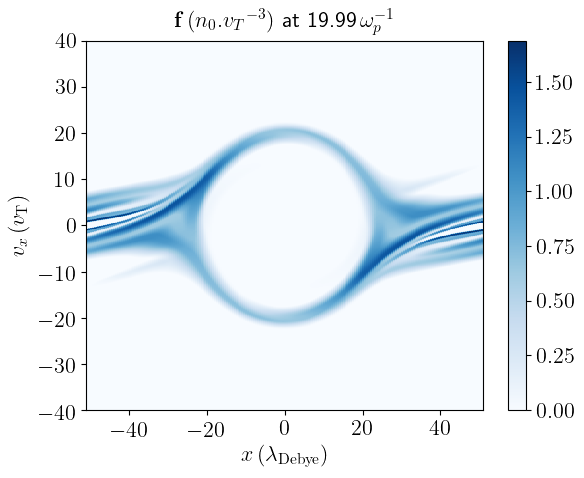

# Summary

ESVM (ElectroStatic Vlasov-Maxwell) is a 1D-1V Vlasov-Maxwell Fortran code parallelized using OpenMP only and developed 
for an educational purpose as well as for testing different numerical advection schemes. Python scripts are provided to automatically extract the simulation results and plot them. Compilation rules can be easily modified depending on the user compiler and preferences using the provided makefile.

# Statement of need

`ESVM` allows for the comparison between different numerical advection schemes to 
compute the electrostatic Vlasov equation as well as the comparison 
between computing the Poisson equation versus computing the Maxwell-Ampere equation with Poisson equation computed at the first time step only.

`ESVM` was designed for an educational purpose to compare Vlasov-Maxwell simulations with Particle-In-Cell ones.
Four academic Plasma Physics cases are provided :
- the two-stream instability; cf. \autoref{fig:two-stream-instability}
- the emission of an electrostatic wakefield \autoref{fig:electrostatic-wakefield}
  by a Gaussian (in space and velocity-space) electron drifting at a mean velocity higher than the plasma electron thermal velocity; cf. \autoref{fig:two-stream-instability}
- the linear Landau damping of an electrostatic wave; cf. \autoref{fig:linear-landau-damping} and 
- the non-linear Landau damping of an electrostatic wave; cf. \autoref{fig:non-linear-landau-damping} and \autoref{fig:non-linear-landau-damping-2}

# Mathematics

The equations computed by the codes are the 1D-1V Vlasov equation for plasma electrons (ions are assumed to be fully ionized with a charge $Z e$ and that they remain immobile with a density $n_i$): 
\begin{equation}
\label{eq:vlasov1d1v}
\displaystyle \frac{\partial f_e}{\partial t} (x,v_x,t) + \displaystyle \frac{\partial }{\partial x} \displaystyle \left ( v_x f_e(x,v_x,t) \right ) - \displaystyle \frac{\partial }{\partial v_x} \displaystyle \left ( \displaystyle \frac{e}{m_e} E_x (x,t) f_e (x,v_x,t)\right ) = 0
\end{equation}
and the coupled Poisson equation for the electrostatic field 
$$
\displaystyle \left \{ \begin{array}{l}
    \displaystyle \frac{\partial \Phi}{\partial x} (x,t) = - E_x (x,t)
\cr \displaystyle \frac{\partial E_x}{\partial x} (x,t) = 4 \pi \displaystyle \left ( Z e n_i - e \displaystyle \int_{-\infty}^\infty f_e (x,v_x,t) \, d v_x \right )
\end{array} \right .
$$
\begin{equation}
\label{eq:poisson}
\Rightarrow \displaystyle \frac{\partial^2 \Phi}{\partial x^2} (x,t) = - 4 \pi \displaystyle \left ( Z e n_i - e \displaystyle \int_{-\infty}^\infty f_e (x,v_x,t) \, d v_x\right )
\end{equation}
or equivalently, the coupled Maxwell-Ampere equation with Poisson equation computed at $t=0$ only
\begin{equation}
\label{eq:ampere}
\displaystyle \left \{ \begin{array}{l}
    \displaystyle \frac{\partial^2 \Phi}{\partial x^2} (x,t=0) = - 4 \pi \displaystyle \left ( Z e n_i - e \displaystyle \int_{-\infty}^\infty f_e (x,v_x,t=0) \, d v_x\right )
\cr  \displaystyle \frac{\partial E_x }{\partial x } (x,t) = 4 \pi e \displaystyle \int_{-\infty}^\infty f_e (x,v_x,t) v_x \, d v_x
\end{array} \right .
\end{equation}

The code units consist in the commonly used electrostatic units : the electron mass $m_e$ for masses, the elementary charge $e$ for electrical charges, the inverse of the Langmuir plasma electron angular frequency $\omega_{p} = \displaystyle \sqrt{ 4 \pi Z n_i e^2 / m_e}$ for times, the Debye electron screening length $\lambda_{\mathrm{Debye}} = \displaystyle \sqrt{k_B T_e / 4 \pi Z n_i e^2}$ where $k_B$ is the Boltzmann constant and $T_e$ the plasma electron temperature (and therefore the thermal plasma electron velocity $v_{T} = \lambda_{\mathrm{Debye}} \omega_{p}$ for velocities) and the constant ion density $n_i$ for densities ($\underline{f}_e = f_e v_{T_e} / n_i$). The resulting electrostatic field unit consequently reads $\underline{E}_x = e E_x / m_e \omega_{p} v_{T}$.

# Figures

