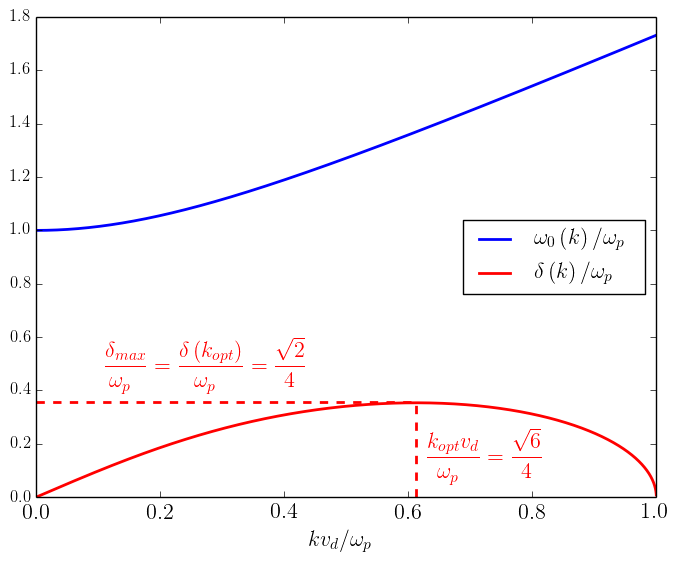
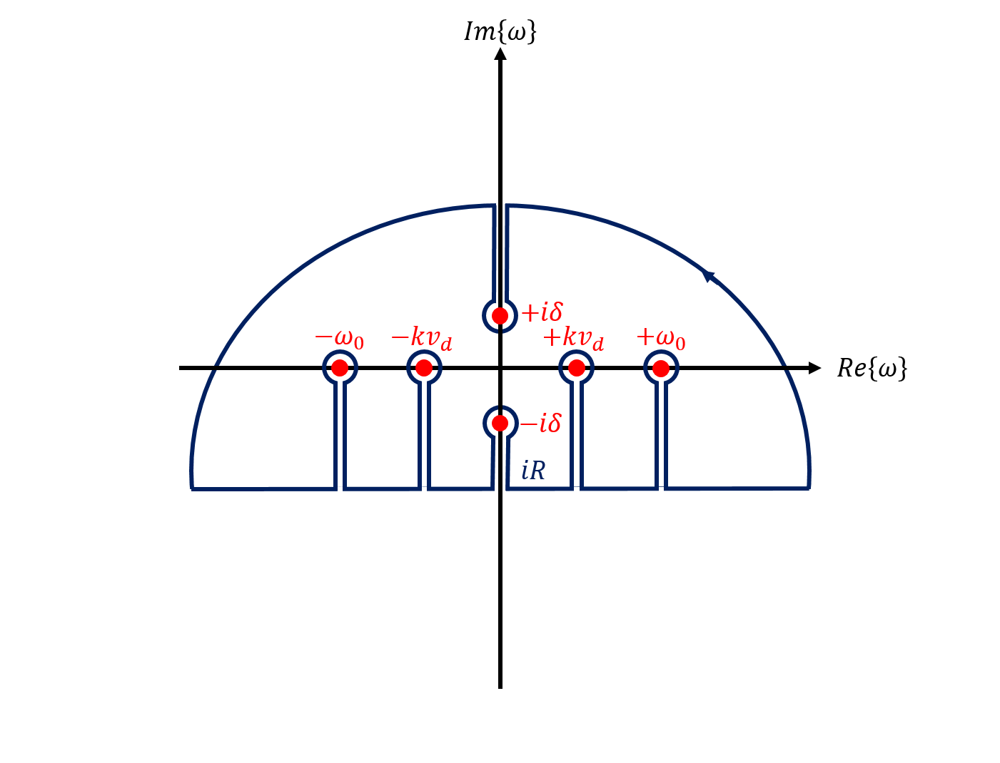
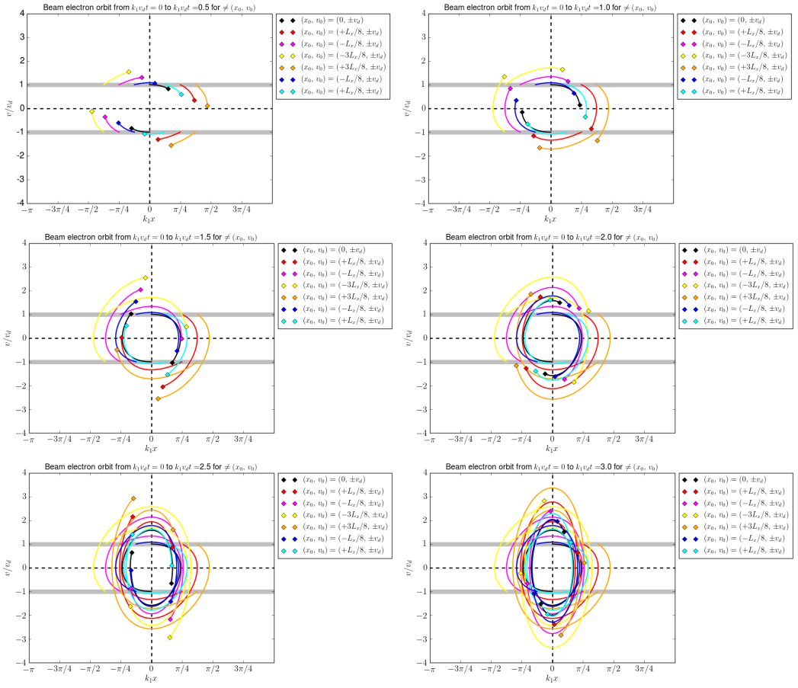

# Summary

A plasma is a set of charged particles consisting of electrons and ionized atoms whose quantity is sufficiently large to behave collectively through the long-distance electromagnetic fields they produce. It is thought that more than 99.9% of visible matter in the Universe is in Plasma state. In a collisionless plasma  consisting in an ionized gas composed of electrons moving in between much heavier ions, any electrostatic field is rapidly screened by the plasma electrons over the Debye screening distance [@DebyeHuckel:1923]. When the number of electrons in these Debye spheres can be assumed to be infinite, the plasma electron population is correctly described by the Vlasov equation [@Vlasov:1938] that neglects all correlations between particles such as the binary Coulomb collisions between them. Besides its simplicity, the resulting Vlasov-Maxwell set of equations is extremely rich in Physics and has many applications ranging from Astrophysics and theoretical Plasma Physics to intense laser-matter interaction experiments. [ESVM](https://github.com/michaeltouati/ESVM) (ElectroStatic Vlasov-Maxwell) is a Vlasov-Maxwell Fortran 95  standard-compliant code, parallelized with OpenMP and using Python 3 for post-processing, that allows for the study of these collisionless plasmas. Many finite volume advection schemes [@Godunov:1959] are implemented in order to discretize the Vlasov equation, namely :
- the donor-cell scheme, i.e. the downwind / upwind scheme [@Courant:1952] depending on the advection direction in each phase-space cell, 
- the Lax-Wendroff scheme [@LaxWendroff:1960], 
- the Fromm scheme [@Fromm:1968],
- the Beam-Warming scheme [@BeamWarming:1976],
- the Van Leer scheme [@VanLeerIII:1977],
- the minmod scheme [@Roe:1986], 
- the superbee scheme [@Roe:1986] and 
- two Monotonic Upwind-centered Scheme for Conservation Laws (MUSCL) [@VanLeerV:1977] schemes MUSCL2 [@Crouseilles:2004] and MUSCL1 [@Duclous:2009]. 

Contrary to the linear second order Lax-Wendroff, Fromm and Beam-Warming schemes, the non-linear second order minmod, superbee, Van Leer and MUSCL schemes make use of a Total Variation Diminishing (TVD) non-linear flux limiter with the price of becoming a first order scheme in some phase-space cells to limit the numerical oscillations. The donor-cell scheme is a first order method and has the pros of limiting such eventual oscillations but the cons of being numerically less consistent and more diffusive. In ESVM, the discretized Vlasov equation is coupled with the self-consistent Maxwell-Gauss equation or equivalently with the Maxwell-Ampere equation with Maxwell-Gauss equation computed at the first time step, only. While the second order Maxwell-Gauss solver needs a computationally expensive inversion of a tridiagonal matrix for the computation of the Poisson equation, the Maxwell-Ampere equation solver makes use of a faster first order numerical scheme (in time). Both absorbing and periodic boundary conditions for both the particles and the fields are implemented. Python scripts, using the Matplotlib and Numpy packages, are provided to automatically extract and plot the stored simulation results. The simulation parameters are described in the [input-deck](https://github.com/michaeltouati/ESVM/blob/master/input-deck) and they can be modified without having to recompile the code. Compilation rules can be modified in the [makefile](https://github.com/michaeltouati/ESVM/blob/master/makefile) depending on the user compiler preferences. Classical Plasma Physics academic case simulations that need less than one CPU$\times$hour each, tools for testing the compilation of the code and tools for checking the simulation parameters are provided. 

# Statement of need

[ESVM](https://github.com/michaeltouati/ESVM) has been developed in order to adapt simulations to specific Plasma Physics problems by chosing the more adequate finite volume numerical advection scheme in order to compute the Vlasov equation phase-space advection derivatives and to chose between computing the Maxwell-Gauss equation or the Maxwell-Ampere equation with Maxwell-Gauss equation computed at the first time step, only. The code aims at beeing used by the open-source Highly Parallel Computing (HPC) Plasma Physics community ranging from under or post-graduate students to teachers and researchers who usually use Particle-In-Cell (PIC) codes [@Dawson:1962] to study collisionless plasmas. Indeed, the PIC method may prohibit the study of Plasma Physical processes on large time scales and/or for very dense collisionless plasmas due to the statistical and numerical fluctuations of the computed quantities imposed by the use of a finite number of particles. Also, plasma instabilities naturally develop in PIC codes, seeded by the available fluctuations spatial spectrum k-vector for which the instability growth rate is maximum and some small amplitude Plasma Physical processes may be hidden under the fluctuactions level. Compared to the many open source PIC codes such as [Smilei](https://github.com/SmileiPIC/Smilei) [@Derouillat:2018] and semi-Lagrangian codes such as [vmf90](https://github.com/pdebuyl/vmf90) [@Debuyl:2014], there is no open source finite volume Vlasov-Maxwell codes in the literature that are not based on an expansion method such as [@Tzoufras:2011],  [AMoRE](https://github.com/michaeltouati/AMoRE) [@Touati:2014] or [Vlapy](https://github.com/joglekara/VlaPy) [@Joglekar:2020]. Finally, since the Vlasov equation is a conservation equation of the probable number of particles in the phase-space, using a finite volume method in order to compute the Vlasov equation presents the advantage of allowing for the use of numerical schemes that are numerically flux conserving and/or that ensure the distribution function positivity compared to other numerical methods. ESVM has already been used during courses for under and post-graduate students about the "numerical tools for laser-plasma interaction Physics" and it is currently used for theoretical Plasma Physics investigations.

# Equations computed by ESVM

Plasma ions are assumed to be immobile with a homogeneous density $n_i$ and fully ionized with an electrical charge $Z e$ where $Z$ is the plasma ion atomic number and $e$ the elementary charge. The plasma electron distribution function $f_e (x,v_x,t)$ is computed by ESVM according to the plasma electron Vlasov equation
\begin{equation}
  \label{eq:vlasov1d1v}
  \displaystyle \frac{\partial f_e}{\partial t} (x,v_x,t) + \displaystyle \frac{\partial }{\partial x} \displaystyle \left ( v_x f_e(x,v_x,t) \right ) - \displaystyle \frac{\partial }{\partial v_x} \displaystyle \left ( \displaystyle \frac{e}{m_e} E_x (x,t) f_e (x,v_x,t)\right ) = 0
\end{equation}
that is self-consistently coupled with the Maxwell-Gauss equation 
\begin{equation}
  \label{eq:gauss}
  \displaystyle \frac{\partial E_x}{\partial x} (x,t) = 4 \pi e \displaystyle \left ( Z n_i - n_e (x,t) \right )
\end{equation}
for the electrostatic field $E_x (x,t)$ or, equivalently, self-consistently coupled with the Maxwell-Ampere equation
\begin{equation}
  \label{eq:ampere}
  \displaystyle \frac{\partial E_x }{\partial t } (x,t) = - 4 \pi j_e(x,t) 
\end{equation}
with Maxwell-Gauss equation \autoref{eq:gauss} computed at the simulation start $t=0$, only. Indeed, by integrating the plasma electron Vlasov equation \autoref{eq:vlasov1d1v} over the whole plasma electron velocity space $v_x \in \left [ v_{x,\mathrm{min}},\, v_{x,\mathrm{max}} \right ]$, one gets the hydrodynamic equation of plasma electron number conservation 
\begin{equation}
  \label{eq:continuity}
  \displaystyle \frac{\partial n_e}{\partial t} (x,t) + \displaystyle \frac{\partial }{\partial x} \displaystyle \left ( n_e v_e(x,t) \right ) = 0,
\end{equation}
which, when injected in the time derivative of Maxwell-Gauss equation \autoref{eq:gauss}, provides the Maxwell-Ampere equation \autoref{eq:ampere} if Maxwell-Gauss equation \autoref{eq:gauss} is verified at the simulation start t=0. Here,
\begin{equation}
  \label{eq:density}
  n_e (x,t) = \displaystyle \int_{v_{x,\mathrm{min}}}^{v_{x,\mathrm{max}}} f_e (x,v_x,t) \, d v_x,
\end{equation}
\begin{equation}
  \label{eq:mean_velocity}
  v_e (x,t) = \displaystyle\frac{1}{n_e (x,t)} \displaystyle \int_{v_{x,\mathrm{min}}}^{v_{x,\mathrm{max}}} f_e (x,v_x,t) v_x \, d v_x
\end{equation}
and
\begin{equation}
  \label{eq:current}
  j_e(x,t) = -e n_e (x,t) v_e (x,t)
\end{equation}
are the plasma electron density, mean velocity and electrical charge current, respectively. ESVM also computes the plasma electron thermal velocity $v_{T_e} (x,t)$ defined according to the plasma electron internal energy density
\begin{equation}
  \label{eq:internal_energy}
  u_{T_e} (x,t) = \displaystyle \frac{ m_e }{2} n_e (x,t) {v_{T_e} (x,t)}^2  = \displaystyle \frac{m_e}{2} \displaystyle \int_{v_{x,\mathrm{min}}}^{v_{x,\mathrm{max}}} f_e (x,v_x,t) {\displaystyle \left ( v_x - v_e (x,t) \right )}^2 \, d v_x.
\end{equation}
For example, in 1D plasmas at local Maxwell-Boltzmann equilibrium, $v_{T_e} (x,t) = \displaystyle \sqrt{k_B T_e (x,t) / m_e}$ where $k_B$ is the Boltzmann constant, $T_e(x,t)$ is the local electron temperature and $m_e$ is the electron mass. Maxwell-Gauss equation \autoref{eq:gauss} is computed by using the electrostatic potential definition 
\begin{equation}
  \label{eq:potential}
  \displaystyle \frac{\partial \Phi}{\partial x} (x,t) = - E_x (x,t)
\end{equation}
that gives the Poisson equation
\begin{equation}
  \label{eq:poisson}
  \displaystyle \frac{\partial^2 \Phi}{\partial x^2} (x,t) = - 4 \pi e \displaystyle \left ( Z n_i - n_e (x,t) \right )
\end{equation}
for the electrostatic potential $\Phi$ when injected in the Maxwell-Gauss equation \autoref{eq:gauss}.
When the simulation is running, ESVM stores at every time steps and displays on the terminal at every dumped time steps $t_d$ the total plasma electron internal and kinetic energy (assuming simulations with an area unit perpendicular to the $x$-axis of ${\lambda_{\mathrm{Debye}}}^2$) and the total electrostatic energy in the simulation box $x \in \left [ x_{\mathrm{min}},\, x_{\mathrm{max}} \right ]$
\begin{equation}
  \label{eq:total_internal_energy}
  U_{T_e} (t_d) = {\lambda_{\mathrm{Debye}}}^2 \displaystyle \int_{x_{\mathrm{min}}}^{x_{\mathrm{max}}} u_{T_e} (x,t_d) \, d x,
\end{equation}
\begin{equation}
\label{eq:total_kinetic_energy}
U_{K_e} (t_d) = {\lambda_{\mathrm{Debye}}}^2 \displaystyle \int_{x_{\mathrm{min}}}^{x_{\mathrm{max}}} \displaystyle \frac{m_e}{2} n_e (x,t) {v_e (x,t_d)}^2 \,  d x
\end{equation}
and
\begin{equation}
  \label{eq:total_electrostatic_energy}
  U_{E_x} (t_d) = {\lambda_{\mathrm{Debye}}}^2 \displaystyle \int_{x_{\mathrm{min}}}^{x_{\mathrm{max}}} \displaystyle \frac{{E_x (x,t_d)}^2}{8 \pi} \, d x,
\end{equation}
respectively, as well as the total energy
\begin{equation}
  U_{\mathrm{tot}} (t_d) = U_{T_e} (t_d)+ U_{K_e} (t_d) + U_{E_x} (t_d)
\end{equation}
in order to check the energy conservation in the simulation. The user can initialize :
- an initial plasma electron population at Maxwell-Boltzmann equilibrium drifting at the velocty $v_d$ 
\begin{equation}
  \label{eq:driftingMaxwellBoltzmannEquilibrium}
  \displaystyle \left \{
  \begin{array}{lll}
      f_e (x,v_x,t=0) &=& \displaystyle \frac{Z n_i}{ \displaystyle \sqrt{ 2 \pi {v_{T_{e_0}}}^2 } } \exp{ \displaystyle \left [ - \displaystyle \frac{ {\left ( v_x - v_d \right ) }^2 }{ 2 {v_{T_{e_0}}}^2 } \right ] }
  \cr E_x (x,t=0) &=& 0
  \end{array} \right .
\end{equation}
by no imposing any perturbation parameter or 
- a provided Plasma Physics academic case; cf. section **ESVM Plasma Physics academic case simulations**. 
- Finally, specific Plasma Physics simulations can easily be added in ESVM by implementing their initialization in the subroutines `INIT_SIMU` and/or `DRIVE` in  the [library.f90](https://github.com/michaeltouati/ESVM/blob/master/sources/library.f90) source file.

# ESVM units

The code units consist in the commonly used electrostatic units : the electron mass $m_e$ for masses, the elementary charge $e$ for electrical charges, the inverse of the Langmuir plasma electron angular frequency $\omega_{p} = \displaystyle \sqrt{ 4 \pi Z n_i e^2 / m_e}$ for times, the Debye electron screening length $\lambda_{\mathrm{Debye}} = v_{T_{e_0}} / \omega_{p}$ and the average plasma electron density $n_0 = Z n_i$ for spatial densities. $v_{T_{e_0}}$ is therefore an important unit parameter of normalization since it fixes indirectly the space unit. It can be defined more generally as the initial plasma electron velocity distribution standard deviation if the plasma is not initialized at Maxwell-Boltzmann thermodynamic equilibrium \autoref{eq:driftingMaxwellBoltzmannEquilibrium}; cf. \autoref{eq:internal_energy}. Injecting these units in the equations computed by the code, detailed in the previous section, one deduces the resulting normalized energies, electrostatic field, electrostatic potential, plasma electron electrical current and distribution function that consequently reads $\underline{U_X} = U_X / \left ( n_0 {\lambda_{\mathrm{Debye}}}^3 m_e {v_{T_{e_0}}}^2 \right )$ where $X=T_e$, $K_e$ or $E_x$, $\underline{E_x} = e E_x / \left ( m_e \omega_{p} v_{T_{e_0}} \right )$, $\underline{\Phi} = e \Phi / \left ( m_e {v_{T_{e_0}}}^2 \right )$, $\underline{j_e} = j_e / \left ( n_0 e v_{T_{e_0}} \right )$ and $\underline{f_e} = f_e v_{T_{e_0}} / n_0$, respectively.

# ESVM numerical stability

The spatial grid cells should be chosen lower than the Debye length $\Delta x < \lambda_{\mathrm{Debye}}$ for the simulation to be Physical. $v_{x,\mathrm{min}}$ and $v_{x,\mathrm{max}}$ should be chosen sufficiently large $|v_{x,\mathrm{min}/\mathrm{max}}| \gg v_{T_{e_0}}$ in such a way that there is no plasma electrons outside the simulation velocity space during the whole simulation; cf. the continuity equation \autoref{eq:continuity}. The simulation velocity bin size should be chosen lower than the thermal electron velocity $\Delta v_x < v_{T_{e_0}}$ and also sufficiently small to capture the desired Physics. The CFL stability condition, from the name of its finder R. Courant, K. Friedrichs and H. Lewy [@Courant:1928], is implemented inside the code in such a way that the user just needs to specify in the input deck the scalar parameter $\mathrm{cfl} < 1$ that fixes the normalized simulation time step according to 
\begin{equation}
\underline{\Delta t}_n = \mathrm{cfl} \times F^n(\underline{\Delta x}, \underline{\Delta v}_x ) < F^n(\underline{\Delta x}, \underline{\Delta v}_x)
\end{equation}
at the time step $\underline{t}_n = \sum_{m=1}^{n} \underline{\Delta t}_m$ at time iteration $n$ where $F^n(\underline{\Delta x}, \underline{\Delta v}_x)$ depends on the chosen numerical scheme. For example, if one notes
\begin{equation}
  \label{eq:vol_def}
\underline{f_e}^{n,i} ( \underline{v_x} ) = \displaystyle \frac{1}{\underline{\Delta x} } \displaystyle \int_{\underline{x}_{i-1/2}}^{\underline{x}_{i+1/2}} \underline{f_e} \left(\underline{x},\underline{v_x},\underline{t}_n\right)\, d \underline{x}
\end{equation}
the finite volume plasma electron distribution function at the phase-space bin located in between $\underline{x}_{i-1/2} = \underline{x}_{i} - \underline{\Delta x}/2$ and $\underline{x}_{i+1/2} = \underline{x}_{i} + \underline{\Delta x}/2$ and one considers the Lax-Wendroff method to compute the advection 
\begin{equation}
  \label{eq:advection}
  \displaystyle \frac{\partial \underline{f_e}}{\partial \underline{t}} + \underline{v_x} \displaystyle \frac{\partial \underline{f_e}}{\partial \underline{x} } = 0
\end{equation}
of plasma electrons along the spatial $\underline{x}$-axis in the phase-space, the numerical scheme reads
\begin{equation}
  \label{eq:LaxWendroff}
  \displaystyle \frac{\underline{f_e}^{n+1,i} - \underline{f_e}^{n,i} }{ \underline{\Delta t}_n } + \underline{v_x} \displaystyle \frac{\underline{F_x}^{n,i+1/2} - \underline{F_x}^{n,i-1/2} }{ \underline{\Delta x} } = 0
\end{equation}
where the plasma electron fluxes across the bin volume interfaces located at $\underline{x}_{i\pm1/2}$ are given by
\begin{equation}
  \label{eq:LaxWendroff_fluxes_plus}
  \underline{F_x}^{n,i+1/2} = \displaystyle \frac{\underline{f_e}^{n,i+1} + \underline{f_e}^{n,i}}{2} - \displaystyle \frac{\underline{v_x} \underline{\Delta t}_n}{\underline{\Delta x}} \displaystyle \frac{\underline{f_e}^{n,i+1} - \underline{f_e}^{n,i}}{2}
\end{equation}
and
\begin{equation}
  \label{eq:LaxWendroff_fluxes_minus}
  \underline{F_x} ^{n,i-1/2} = \displaystyle \frac{\underline{f_e}^{n,i} + \underline{f_e}^{n,i-1}}{2} - \displaystyle \frac{\underline{v_x} \underline{\Delta t}_n }{\underline{\Delta x}} \displaystyle \frac{\underline{f_e}^{n,i} - \underline{f_e}^{n,i-1}}{2}.
\end{equation}
According to the Taylor expansion of $\underline{f_e}^{n,i+i}$, $\underline{f_e}^{n,i-i}$ and $\underline{f_e}^{n+1,i}$ close to $(\underline{x}_i,\underline{t}_n)$ up to the third order in space and time, one can check the Lax-Wendroff numerical consistency error is indeed of second order :
\begin{equation}
  \label{eq:LaxWendroff_error}
  \begin{array}{lll}
  \underline{\epsilon}^{n,i} &=& \displaystyle \frac{\underline{f_e}^{n+1,i} - \underline{f_e}^{n,i} }{ \underline{\Delta t}_n } + \underline{v_x} \displaystyle \frac{\underline{F_x}^{n,i+1/2} - \underline{F_x}^{n,i-1/2} }{ \underline{\Delta x} }- \displaystyle \left (  {\left . \displaystyle \frac{\partial \underline{f_e} }{\partial \underline{t}} \right |}^{n,i} + \underline{v_x}  {\left . \displaystyle \frac{\partial \underline{f_e} }{\partial \underline{x}} \right |}^{n,i} \right )
  \cr &=& \displaystyle \frac{ {\underline{\Delta t}_n}^2 }{6} {\left . \displaystyle \frac{\partial^3 \underline{f_e} }{\partial \underline{t}^3} \right |}^{n,i}  + \underline{v_x} \displaystyle \frac{ {\underline{\Delta x}}^2 }{6}  {\left . \displaystyle \frac{\partial^3 \underline{f_e} }{\partial \underline{x}^3} \right |}^{n,i} + O\left ( {\underline{\Delta t}_n}^3 + {\underline{\Delta x}}^3 + \underline{\Delta t}_n {\underline{\Delta x}}^2\right ).
  \end{array}
\end{equation}
By using the Von Neumann stability analysis, assuming periodic boundary conditions for simplicity and noting
\begin{equation}
  \label{eq:VonNeumann}
   \widehat{\underline{f_e}}^n(\underline{k}^p) = \displaystyle \frac{1}{ N_x } \displaystyle \sum_{i=1}^{N_x} \underline{f_e}^{n,i} \exp{\left (- \iota \underline{k}^p \underline{x}_i \right )} \Leftrightarrow \underline{f_e}^{n,i}  = \displaystyle \sum_{p=1}^{N_x} \widehat{\underline{f_e}}^n(\underline{k}^p)  \exp{\left ( \iota \underline{k}^p \underline{x}_i \right )}
\end{equation}
with $\iota^2=-1$, $N_x=1+(\underline{x}_{\mathrm{max}}-\underline{x}_{\mathrm{min}})/\underline{\Delta x}$ the number of spatial grid points and $\underline{k}^p = 2 \pi (p-1) / (\underline{x}_{\mathrm{max}}-\underline{x}_{\mathrm{min}})$ the discrete Fourier mode, one gets by injecting \autoref{eq:VonNeumann} in \autoref{eq:LaxWendroff}
\begin{equation}
\displaystyle \frac{ \widehat{\underline{f_e}}^{n+1} (\underline{k}^p) }{  \widehat{\underline{f_e}}^{n} (\underline{k}^p) } =  1 - \displaystyle \frac{\underline{v_x} \underline{\Delta t}_n}{\underline{\Delta x} } \iota \sin{\left ( \underline{k}^p \underline{\Delta x} \right )} + { \left (  \displaystyle \frac{ \underline{v_x} \underline{\Delta t}_n }{ \underline{\Delta x} } \right )}^2 \left [ \cos{\left ( \underline{k}^p \underline{\Delta x} \right )}   -1 \right ]
\end{equation}
for each term $p$ of the series. It implies the numerical scheme is stable,
\begin{equation}
  \mathrm{meaning} \,\displaystyle \left | \displaystyle \frac{ \widehat{\underline{f_e}}^{n+1} (\underline{k}^p) }{ \widehat{\underline{f_e}}^{n} (\underline{k}^p) } \right | < 1,\,\mathrm{if}\,\underline{\Delta t}_n < \displaystyle \frac{ \underline{\Delta x} }{ \underline{v_x} } .
\end{equation}
Performing the same reasoning when also considering the advection of plasma electrons along the $\underline{v_x}$-axis in the phase-space due to the action of the electrostatic field, with bins centered at $\underline{v_x}^\ell = \underline{v_{x,\mathrm{min}}} + (\ell-1 ) \underline{\Delta v}_x$ where $\ell \in \left[ 1,N_{v_x} \right ]$ and $N_{v_x} = 1 + (\underline{v_{x,\mathrm{max}}}-\underline{v_{x,\mathrm{min}}}) / \underline{\Delta v}_x$, in order to compute the Vlasov equation \autoref{eq:vlasov1d1v} and update all $\underline{f_e}^{n,i,\ell}$ with each numerical scheme implemented in ESVM, one finds (sometimes empirically when it is too difficult analytically) that
\begin{equation}
  \label{CFL}
  F^n(\underline{\Delta x}, \underline{\Delta v}_x) = \displaystyle \frac{1/2}{ \displaystyle \frac{ \underset{\ell \in [1,N_{v_x}]}{\mathrm{max}}\{ \underline{v}_x^\ell \} }{ \underline{\Delta x} } + \displaystyle \frac{ \underset{i \in [1,N_x]}{\mathrm{max}}\{ \underline{E}_x^{n,i} \} }{ \underline{\Delta v}_x } }.
\end{equation}
is a sufficient CFL stability condition for all numerical schemes implemented in ESVM to be stable.

# ESVM Plasma Physics academic case simulations

Four well-known Plasma Physics academic cases are provided with ESVM :
1) the emission of an electrostatic wakefield by a Gaussian electron; cf. \autoref{fig:electrostatic-wakefield}
2) the linear Landau damping of an electron plasma wave; cf. \autoref{fig:linear-landau-damping}, 
3) the non-linear Landau damping of an electron plasma wave; cf. \autoref{fig:non-linear-landau-damping} and 
4) the two-stream instability of two counter-propagating symmetric Gaussian electron beams; cf. \autoref{fig:two-stream-instability}.

For each academic case, an example of input deck is provided together with one corresponding simulation result plot that the code typically generates. For 1), 2) and 3), the simulation is initialized assuming a non-drifting collisionless plasma at Maxwell-Boltzmann equilibrium 
\begin{equation}
  \label{eq:MaxwellBoltzmannEquilibrium}
  \displaystyle \left \{
  \begin{array}{lll}
      f_e^{(0)} (x,v_x,t=0) &=& \displaystyle \frac{Z n_i}{ \displaystyle \sqrt{ 2 \pi {v_{T_{e_0}}}^2 } } \exp{ \displaystyle \left [ - \displaystyle \frac{ {v_x}^2 }{ 2 {v_{T_{e_0}}}^2 } \right ] }
  \cr E_x^{(0)} (x,t=0) &=& 0
  \end{array} \right .
\end{equation}
that is perturbed :
- with a small perturbation 
\begin{equation}
   \label{eq:Gaussian_electron}
  \delta f_e (x,v_x,t=0)= A \displaystyle \frac{ Z n_i }{ 2 \pi \delta x \delta v } \exp{ \displaystyle \left [ - \displaystyle \frac{ {(x-x_d)}^2 }{ 2 {\delta x}^2 } \right ] } \exp{ \displaystyle \left [ - \displaystyle \frac{ {(v_x-v_d)}^2 }{ 2 {\delta v}^2 } \right ] },
\end{equation}
consisting in a Gaussian electron located at $x_d = x_{\mathrm{min}} + ( x_{\mathrm{max}}-x_{\mathrm{min}} )/8$ with a standard deviation $\delta x = \lambda_{\mathrm{Debye}} / 4$ and drifting at a velocity $v_d$ with a standard deviation $\delta v = v_{T_{e_0}} / 40$ at the simulation start $t=0$ for 1), and 
- with a small perturbation consisting in a small amplitude electron plasma wave
\begin{equation}
  \label{eq:EPW}
  \delta E_x (x,t < \delta t) = A \displaystyle \frac{m_e \omega_p v_{T_{e_0}}}{e} \sin{ \displaystyle \left ( \omega_0 t - k x \right ) }
\end{equation}
propagating during a short time interval $\delta t = 6 \pi / \omega_0$ after the simulation start $t=0$ for 2) and 3). 

Only the perturbation amplitudes $A < 1$ for 1), 2) and 3), the perturbation drift velocity  $v_d > v_{T_{e_0}}$ for 1) and the perturbation temporal and spatial angular frequencies $\omega_0$ and $k$ for 2) and 3) should be modified by the user when filling the input-deck in such a way that
\begin{equation}
  \displaystyle \left \{
  \begin{array}{lllll}
      f_e (x,v_x,t) &=& f_e^{(0)} (x,v_x,t) &+& \delta f_e (x,v_x,t)
  \cr E_x (x,t) &=& E_x^{(0)} (x,t) &+& \delta E_x (x,t)
  \end{array} \right . \, \mathrm{with}\, \left | \delta f_e (x,v_x,t) \right | \ll f_e^{(0)} (x,v_x,t)
\end{equation}
keeps being respected during the linear stage of the simulation. Except for non-linear Plasma Physics processes such as 3) for which the non-linear theory should be considered [@GaleevSagdeev:1969], the methodology that can be used to check any ESVM simulation results is always the same. Only analytical estimates used to check the ESVM simulation results of the provided academic case 4) are consequently detailed here in order to highlight it. The user can check the provided academic case simulation results 1), 2) and 3) by directly comparing the ESVM simulation results with the analytical estimates provided in [@Decyk:1987] (available at [https://picksc.idre.ucla.edu/wp-content/uploads/2015/04/DecykKyiv1987.pdf](https://picksc.idre.ucla.edu/wp-content/uploads/2015/04/DecykKyiv1987.pdf)) and in the reference texbooks [@LandauLifshitz:1981] and [@GaleevSagdeev:1969], respectively. 

The provided Plasma Physics academic case 4) is initialized assuming two counter-propagating homogeneous Gaussian electron beams '$e,+$' and '$e,-$' of exactly opposite drift velocity $\pm v_d$ with same standard deviation $v_{T_{e_0}}$
\begin{equation}
  \label{eq:EDF}
  f_e^{(0)} \displaystyle \left ( x,v_x,t\right ) = f_{e,+}^{(0)} \displaystyle \left (x,v_x,t \right ) + f_{e,-}^{(0)} \displaystyle \left (x,v_x,t \right )
\end{equation}
with
\begin{equation}
  f_{e,\pm}^{(0)} \displaystyle \left (x,v_x,t\right ) = \displaystyle \frac{Z n_i / 2}{\sqrt{2 \pi {v_{T_{e_0}}}^2} } \exp{ \displaystyle \left [ - \displaystyle \frac{ {\left ( v_x \mp v_d \right )}^2 }{ 2 {v_{T_{e_0}}}^2 } \right ] }
\end{equation}
that is a solution of the Vlasov Equation \autoref{eq:vlasov1d1v} and that doesn't produce any electrostatic fields 
\begin{equation}
  E_x^{(0)}(x,t)  = 0
\end{equation}
according to Maxwell-Gauss Equation \autoref{eq:gauss}. If one computes the Vlasov-Maxwell set of Equations $\{$\autoref{eq:vlasov1d1v}, \autoref{eq:gauss}$\}$ exactly, initializing it with the two-stream equilibrium distribution function \autoref{eq:EDF} without any perturbation, the counter-propagating electron beams would continue their propagation through the immobile plasma ions without any modification. In order to observe the two-stream instability, 
\begin{equation}
  \label{eq:perturbed_beams}
  f_e \displaystyle \left ( x,v_x,t=0\right ) = f_e^{(0)} \displaystyle \left ( x,v_x,t=0 \right ) + \delta f_{e} \displaystyle \left ( x,v_x,t=0 \right ),
\end{equation}
is initialized instead by adding a small perturbation 
\begin{equation}
  \label{eq:perturbation}
  \delta f_{e}\displaystyle \left ( x,v_x,t=0 \right ) = \delta f_{e,+}\displaystyle \left ( x,v_x,t=0 \right ) + \delta f_{e,-}\displaystyle \left ( x,v_x,t=0 \right )
\end{equation}
on each beam of the form 
\begin{equation}
\delta f_{e,\pm} \displaystyle \left ( x,v_x,t=0 \right ) = \pm A \sin{\displaystyle \left ( k_1 x \right )  } f_{e,\pm}^{(0)} \displaystyle \left ( x,v_x,t=0 \right )
\end{equation}
at the simulation start $t=0$ with $A = 0.1$ and $k_1 = 2 \pi / L_x$ (parameter $k$ in the input-deck) that can be modified by the user in the input-deck where $L_x= x_{\mathrm{max}} - x_{\mathrm{min}}$. 

In order to get analytical estimates of the exponentially growing electrostatic field, plasma electron density and mean velocity perturbations in this ESVM simulation, one can linearize the Vlasov equation \autoref{eq:vlasov1d1v} and the self-consistent Maxwell-Gauss equation \autoref{eq:gauss} computed by ESVM assuming the perturbation \autoref{eq:perturbation} remains small compared to the equilibrium distribution \autoref{eq:EDF} during the simulation. They read
\begin{equation}
  \label{eq:linearized_vlasov1d1v}
  \displaystyle \frac{\partial \delta f_e }{ \partial t} + \displaystyle \frac{\partial }{\partial x} \displaystyle \left ( v_x \delta f_e \right ) - \displaystyle \frac{e}{m_e} \displaystyle \frac{d f_e^{(0)}}{d v_x} \delta E_x= 0
\end{equation}
and
\begin{equation}
  \label{eq:linearized_gauss}
  \displaystyle \frac{ \partial \delta E_x}{ \partial x } = - 4 \pi e \displaystyle \int_{-\infty}^\infty \delta f_e \, d v_x,
\end{equation}
up to the first order. Considering periodic boundary conditions, we may use a one-sided Fourier transformation in time (thus equivalent to a Laplace transform) and a Fourier series expansion in space for such a $L_x$-periodic initial condition problem. We will note
\begin{equation}
  \label{eq:Fourier_series}
  \widehat{\text{X}}_p \displaystyle \left ( t \right ) = \displaystyle \frac{1}{L_x} \displaystyle \int_{0}^{L_x}  X \displaystyle \left ( x,\,t\right) \exp{ \displaystyle \left (+ \iota k_p x \right )  } d x \Leftrightarrow
 X \displaystyle \left ( x,\,t \right ) = \displaystyle \sum_{p=-\infty}^\infty \widehat{\text{X}}_p \displaystyle \left ( t \right) \exp{ \displaystyle \left (- \iota k_p x \right ) }
\end{equation}
with $\forall p \in \mathbb{Z},\, k_p = 2 \pi p / L_x$ and
\begin{equation}
  \begin{array}{lrllclcrl}
                             & \widehat{\widehat{\text{X}}}_p^{(+)} \displaystyle \left ( \omega \right ) &=& \displaystyle \int_{0}^\infty                                                 & d t                                                    &                                                   &     & \widehat{\text{X}}_p \displaystyle \left ( t\right) & \exp{ \displaystyle \left ( - \iota \omega t \right ) }
\cr                         &                                                                                                                &=& \displaystyle \int_{0}^\infty                                                     & d t                                                    & \displaystyle \int_{0}^{L_x} & \displaystyle \frac{d x}{L_x} &  X \displaystyle \left ( x,\,t\right) & \exp{ \displaystyle \left [ - \iota \displaystyle \left ( \omega t - k_p x \right ) \right ] }
\cr  \Leftrightarrow & X \displaystyle \left ( x,\,t\right)                                                               &=& \displaystyle \int_{\iota R - \infty}^{\iota R + \infty} & \displaystyle \frac{d \omega}{2 \pi}  & \displaystyle \sum_{p=-\infty}^\infty &   & \widehat{\widehat{\text{X}}}_p^{(+)} \displaystyle \left ( \omega \right ) &  \exp{ \displaystyle \left [ + \iota \displaystyle \left ( \omega t - k_p x \right ) \right ] }
\end{array}
\end{equation}
where the integral in the complex $\omega$-plane is taken along a straight line $\omega = \iota R$. By multiplying \autoref{eq:linearized_vlasov1d1v} and \autoref{eq:linearized_gauss} by $\exp{ \displaystyle \left [ - \iota \displaystyle \left ( \omega t - k_p x \right ) \right ]  } / L_x$ and by integrating them from $x=0$ to $x=L_x$ and from $t=0$ to $t = \infty$, we obtain respectively 
\begin{equation}
  \label{eq:Eq1}
  \widehat{\widehat{\delta \text{f} }}_{e,p}^{(+)} =  \displaystyle \frac{1}{\iota \displaystyle \left ( \omega - k_p v_x \right )} \displaystyle \left [ \widehat{\delta \text{f}}_{e,p} \displaystyle \left ( v_x,\,t=0\right )  + \displaystyle \frac{e}{m_e} \displaystyle \frac{d f_e^{(0)}}{d v_x} \widehat{\widehat{\delta \text{E}}}_{x,p}^{(+)} \right ]
\end{equation}
with
\begin{equation}
  \widehat{\delta \text{f}}_{e,p} \displaystyle \left ( v_x,\,t=0\right ) = \alpha_p A \displaystyle \frac{ Z n_i / 2}{ \displaystyle \sqrt{2 \pi {v_{T_{e_0}}}^2 } } \displaystyle \left \{  \exp{ \displaystyle \left [ - \displaystyle \frac{ {\displaystyle \left ( v_x - v_d \right )}^2 }{ 2 {v_{T_{e_0}}}^2 }\right ] } - \exp{ \displaystyle \left [ - \displaystyle \frac{ {\displaystyle \left ( v_x + v_d \right )}^2 }{ 2 {v_{T_{e_0}}}^2 }\right ] }  \right \}
\end{equation}
where
\begin{equation}
  \alpha_p = \displaystyle \left \{
  \begin{array}{lll}
      \mp 1 / 2 \iota &\text{if} & p = \pm 1
  \cr 0 &\text{else}&
  \end{array} \right .
\end{equation}
and
\begin{equation}
  \label{eq:Eq2}
   \widehat{\widehat{\delta \text{E}}}_{x,p}^{(+)} = \displaystyle \frac{4 \pi e}{\iota k_p} \displaystyle \int_{-\infty}^\infty \widehat{\widehat{ \delta \text{f}}}_{e,p}^{(+)}  \displaystyle \left ( \omega,\,v_x \right ) d v_x.
\end{equation}
Injecting \autoref{eq:Eq1} in \autoref{eq:Eq2}, we obtain the Fourier components of the electrostatic field Laplace transform
\begin{equation}
  \label{eq:Eq3}
  \begin{array}{lcl}
  \widehat{\widehat{\delta \text{E}}}_{x,p}^{(+)} \displaystyle \left ( \omega \right ) &=& \displaystyle \frac{4\pi e}{ {k_p}^2 \epsilon \displaystyle \left ( \omega,\,k_p\right )} \displaystyle \int_{-\infty}^\infty \displaystyle \frac{  \widehat{\delta \text{f}}_{e,p} \displaystyle \left ( v_x,\,t=0\right ) }{v_x - \omega / k_p } d v_x
  \cr &=& \alpha_p \displaystyle \frac{A}{ 2 \sqrt{2} } \displaystyle \frac{m_e v_{T_{e_0}}}{ e } \displaystyle \frac{ \mathcal{Z}  \displaystyle \left ( \displaystyle \frac{ \omega / k_p - v_d }{ v_{T_{e_0}} \sqrt{2} } \right ) - \mathcal{Z}  \displaystyle \left ( \displaystyle \frac{ \omega / k_p + v_d }{ v_{T_{e_0}} \sqrt{2} } \right ) }{ \epsilon \displaystyle \left ( \omega,\,k_p\right ) {\displaystyle \left ( k_p \lambda_\mathrm{Debye}\right ) }^2 }
  \end{array}
\end{equation}
where the plasma electrical permittivity reads
\begin{equation}
  \label{eq:plasma_electrical_permittivity}
  \begin{array}{lll}
  \epsilon \displaystyle \left ( \omega,\,k \right )   &=&  1 - \displaystyle \frac{4 \pi e^2}{m_e {k}^2} \displaystyle \int_{-\infty}^\infty \displaystyle \frac{ 1 }{ v_x - \omega / k } \displaystyle \frac{ d f_e^{(0)} }{ d v_x } d v_x
  \cr                                                  &=&  1 + \displaystyle \frac{1}{ {\displaystyle \left ( k \lambda_{\mathrm{Debye}} \right )}^2} \displaystyle \left \{ 1 + \displaystyle \frac{1}{2} \displaystyle \left [ F \displaystyle \left ( \displaystyle \frac{ \omega / k - v_d }{ v_{T_{e_0}} \sqrt{2} } \right ) +  F \displaystyle \left ( \displaystyle \frac{ \omega / k + v_d }{ v_{T_{e_0}} \sqrt{2} } \right ) \right ] \right \}
\end{array}
\end{equation}
depending on the plasma dispersion function [@FriedComte:1961]
\begin{equation}
  \label{eq:plasma_dispersion_function}
  F \displaystyle \left ( \zeta \right ) = \zeta \mathcal{Z} \displaystyle \left ( \zeta \right ) \text{ and } \mathcal{Z} \displaystyle \left ( \zeta \right ) = \displaystyle \frac{ 1 }{ \sqrt{\pi} } \displaystyle \int_{-\infty}^\infty \displaystyle \frac{ \exp{ \displaystyle \left ( - z^2 \right ) } }{ z - \zeta } d z.
\end{equation}
Since $v_d \gg v_{T_{e_0}}$ in this ESVM simulation, we have the condition 
\begin{equation}
  \label{eq:assumption}
  \displaystyle \left | \displaystyle \frac{\omega}{k_p} \pm v_d \right | \gg v_{T_{e_0}} \sqrt{2}
\end{equation}
that is fulfilled for any given spatial frequency mode $k_p$ and one thus may use the asymptotic limit
\begin{equation}
  \label{eq:plasma_dispersion_function_2ndorder}
  F \displaystyle \left ( \zeta \right ) \underset{|\zeta| \gg 1 }{=}  \iota  \zeta \sqrt{\pi}  \exp{ \displaystyle \left ( - \zeta^2 \right ) }  - 1 - \displaystyle \frac{ 1 }{ 2 \zeta^2} - \displaystyle \frac{ 3 }{ 4 \zeta^4} + O \displaystyle \left ( \displaystyle \frac{ 1 }{ \zeta^6 } \right )
\end{equation}
that leads to the simpler dispersion relation 
\begin{equation}
  \label{eq:plasma_electrical_permittivity_limit}
  \epsilon \displaystyle \left ( \omega,\,k \right ) \underset{v_d \gg v_{T_{e_0}}}{=} 1 - \displaystyle \frac{ {\omega_{p}}^2 }{ 2 } \displaystyle \left [  \displaystyle \frac{ 1 }{ {\displaystyle \left ( \omega - k v_d \right )}^2 } + \displaystyle \frac{ 1 }{ {\displaystyle \left ( \omega + k v_d \right )}^2 } \right ] = 0
\end{equation}
retaining only the main term in the series expansion of the dispersion function \autoref{eq:plasma_dispersion_function} up to the second order \autoref{eq:plasma_dispersion_function_2ndorder}. In this limit, the dispersion relation \autoref{eq:plasma_electrical_permittivity_limit} provides four pure real solutions $\displaystyle \left \{ \omega_1\displaystyle \left ( k \right ),\,\omega_2\displaystyle \left ( k \right ),\,\omega_3\displaystyle \left ( k \right ),\,\omega_4\displaystyle \left ( k \right )  \right \} \in \mathbb{R}^4$ for wavenumber $k$ greater or equal than the critical wavenumber $\omega_{p} / v_d$. It means that the two counter-propagating electron beams remain stable on space scales smaller than $2 \pi v_d /\omega_{p}$. However, in the case where $k_p < \omega_{p} / v_d$ considered here, one finds in addition to the two real poles
\begin{equation}
  \label{eq:pure_real_poles}
  \omega_{1/2} \displaystyle \left ( k < \displaystyle \frac{\omega_{p} }{ v_d }\right )= \pm \omega_0 \displaystyle \left ( k \right )
\end{equation}
where
\begin{equation}
  \label{eq:omega0}
  \omega_0 \displaystyle \left ( k \right ) = \omega_{p} \displaystyle \sqrt{ {\displaystyle \left ( \displaystyle \frac{ k v_d }{ \omega_{p} } \right )}^2 + \displaystyle \frac{1}{2} \displaystyle \left ( 1 + \displaystyle \sqrt{ 1 + 8 {\displaystyle \left ( \displaystyle \frac{ k v_d }{ \omega_{p} } \right )}^2 } \right ) } \underset{ k v_d \ll   \omega_{p} }{\sim} \omega_{p},
\end{equation}
two another pure imaginary conjugate poles
\begin{equation}
  \label{eq:pure_imaginary_poles}
  \omega_{3/4} \displaystyle \left ( k < k_c \right )=  \pm \iota \delta \displaystyle \left ( k \right ).
\end{equation}
It means that the two counter-propagating electron beams streaming throught the immobile plasma ions are unstable on space scales greater than $2 \pi v_d /\omega_{p}$ and that this two-stream instability grows exponentially at the rate
\begin{equation}
  \label{eq:growth_rate}
  \delta \displaystyle \left ( k \right ) = \omega_{p} \displaystyle \sqrt{  \displaystyle \frac{1}{2} \displaystyle \left ( \displaystyle \sqrt{ 1 + 8 {\displaystyle \left ( \displaystyle \frac{ k v_d }{ \omega_{p} } \right )}^2 } - 1 \right ) - {\displaystyle \left ( \displaystyle \frac{ k v_d }{ \omega_{p} } \right )}^2 }  \underset{ k v_d \ll   \omega_{p} }{\sim} \displaystyle \left | k \right | v_d.
\end{equation}
The stable electron plasma waves angular frequency \autoref{eq:omega0} and the two stream instability growth rate \autoref{eq:growth_rate} are plotted in  \autoref{fig:poles} as a function of the angular spatial frequency mode $k$. Retaining the main terms in the series expansions of $\mathcal{Z}$ up to the second order in \autoref{eq:Eq3} according to \autoref{eq:plasma_dispersion_function_2ndorder}, the Fourier components of the electrostatic field Laplace transform  simplify into
\begin{equation}
  \label{eq:electrostatic_field_Fourier_modes}
  \widehat{\widehat{\delta \text{E}}}_{x,p}^{(+)} \displaystyle \left ( \omega \right ) \underset{v_d \gg v_{T_{e_0}}}{\sim} - \alpha_p A \displaystyle \frac{m_e v_d}{ e } \displaystyle \frac{  {\omega_{p}}^2  }{ \epsilon \displaystyle \left ( \omega,\,k_p\right ) \displaystyle \left ( \omega - k_p v_d \right ) \displaystyle \left ( \omega + k_p v_d \right )  }.
\end{equation}
The poles of the Fourier components of the electrostatic fields \autoref{eq:electrostatic_field_Fourier_modes} are thus $\pm k_p v_d$ plus the ones of the plasma electrical permittivity \autoref{eq:plasma_electrical_permittivity_limit} given by Equations \ref{eq:pure_real_poles} and \autoref{eq:pure_imaginary_poles}. We can know determine the time dependence of the spatial Fourier components of the growing electrostatic field
\begin{equation}
  \label{Inversion_Formula}
  \widehat{\delta \text{E}}_{x,p} \displaystyle \left ( t \right ) = \displaystyle \frac{1}{2 \pi} \displaystyle \int_{\iota R - \infty}^{\iota R + \infty} \widehat{\widehat{\delta \text{E}}}_{x,p}^{(+)} \displaystyle \left ( \omega \right )  \exp{\displaystyle \left ( + \iota \omega t \right )} d \omega
\end{equation} 
by using the residue theorem with the contour illustrated in \autoref{fig:integration_contour} in order to evaluate the Cauchy principal value of this integral : since the function to integrate in \autoref{Inversion_Formula} is an analytic function of $\omega$ defined in the whole complex plane, we moved the contour of integration usually taken slightly above the real axis into the lower half-plane sufficiently far beneath the pole $- \iota \delta$ and passing round this pole and round the other poles lying above it in such a way that it doesn't cross any of the poles of the function. We thus obtain
\begin{equation}
  \begin{array}{llllccll}
  \widehat{\delta \text{E}}_{x,p} \displaystyle \left ( t \right ) &=&  A & E_0 & \alpha_p &\displaystyle \frac{ \omega_{p} }{ \delta \displaystyle \left ( k_p \right ) }      &\displaystyle \frac{ {\delta \displaystyle \left ( k_p \right )}^2 + {\displaystyle \left ( k_p v_d\right )}^2 }{ {\delta \displaystyle \left ( k_p \right )}^2 + {\omega_0 \displaystyle \left ( k_p \right )}^2 } &  \sinh{ \displaystyle \left [ \delta \displaystyle \left ( k_p \right ) t \right ] }  
\cr                                                                                      &+&  A  &\displaystyle \frac{E_0 }{2} &  \alpha_p&\displaystyle \frac{ \omega_{p} }{ \omega_0 \displaystyle \left ( k_p \right ) } &\displaystyle \frac{ { \omega_0 \displaystyle \left ( k_p \right ) }^2 - {\displaystyle \left ( k_p v_d\right )}^2 }{ {\delta \displaystyle \left ( k_p \right )}^2 + {\omega_0 \displaystyle \left ( k_p \right )}^2 } & \sin{ \displaystyle \left [ \omega_0 \displaystyle \left ( k_p \right ) t \right ] }                                                                                
  \end{array}
\end{equation}
with
\begin{equation}
E_0 = \displaystyle \frac{m_e v_d \omega_{p}}{e}
\end{equation}
that finally gives according to the Fourier series expansion \autoref{eq:Fourier_series}
\begin{equation}
  \label{eq:electrostatic_field}
  \begin{array}{llcccll}
   \delta E_x \displaystyle \left ( x,\,t \right ) &=& A & E_0 &\displaystyle \frac{ {\omega_{p}} }{ \delta \displaystyle \left ( k_1 \right ) } & \displaystyle \frac{ {\delta \displaystyle \left ( k_1 \right )}^2 + {\displaystyle \left ( k_1 v_d\right )}^2 }{  {\delta \displaystyle \left ( k_1 \right )}^2 + {\omega_0 \displaystyle \left ( k_1 \right )}^2 } &\sinh{ \displaystyle \left [ \delta \displaystyle \left ( k_1 \right ) t \right ] } \sin{\displaystyle \left ( k_1 x \right )}
  \cr                                              &+& A & \displaystyle \frac{E_0}{2} & \displaystyle \frac{ {\omega_{p}} }{ \omega_0 \displaystyle \left ( k_1 \right ) } & \displaystyle \frac{ {\omega_0 \displaystyle \left ( k_1 \right )}^2 - {\displaystyle \left ( k_1 v_d\right )}^2 }{  {\delta \displaystyle \left ( k_1 \right )}^2 + {\omega_0 \displaystyle \left ( k_1 \right )}^2 } & \sin{ \displaystyle \left [ \omega_0 \displaystyle \left ( k_1 \right ) t \right ] } \sin{\displaystyle \left ( k_1 x \right )}.
  \end{array}
\end{equation}
Knowing the electrostatic field \autoref{eq:electrostatic_field}, one may also deduce the perturbed distribution function according to \autoref{eq:linearized_vlasov1d1v}. It reads 
\begin{equation}
  \begin{array}{lll}
  { \delta f}_{e} \displaystyle \left ( x,\, v_x,\,t \right )  &=&  \delta f_{e} \displaystyle \left ( x,\, v_x,\,t=0\right )  + \displaystyle \frac{e}{m_e} \displaystyle \frac{d f_{e}^{(0)}}{d v_x}  \displaystyle \left ( v_x \right ) \displaystyle \int_0^t \delta E_{x} \displaystyle \left [ x + v_x \displaystyle \left ( \tau - t \right ) ,\, \tau \right ] d \tau
  \cr &=& f_{e,+}^{(0)}  \displaystyle \left ( v_x \right ) \displaystyle \left [ + A \sin{ \displaystyle \left ( k_1 x \right ) } + \displaystyle \frac{ v_d - v_x  }{ {v_{T_{e_0}}^2 }} \displaystyle \frac{e}{m_e} \displaystyle \int_0^t \delta E_{x} \displaystyle \left [ x + v_x \displaystyle \left ( \tau - t \right ) ,\, \tau \right ] d \tau  \right ]
  \cr &+& f_{e,-}^{(0)}  \displaystyle \left ( v_x \right ) \displaystyle \left [ - A \sin{ \displaystyle \left ( k_1 x \right ) } -  \displaystyle \frac{ v_d + v_x  }{ {v_{T_{e_0}}^2 }} \displaystyle \frac{e}{m_e} \displaystyle \int_0^t \delta E_{x} \displaystyle \left [ x + v_x \displaystyle \left ( \tau - t \right ) ,\, \tau \right ] d \tau  \right ].
  \end{array}
\end{equation}
In the limit $k_p v_d \ll \omega_{p}$, they simplify into
\begin{equation}
 \delta E_x \displaystyle \left ( x,\,t \right ) \underset{k_1 v_d \ll \omega_{p}}{\sim}  A \displaystyle \frac{E_0}{2}  \displaystyle \left [  \sin{ \displaystyle \left ( \omega_{p} t \right ) } + 4 \displaystyle \frac{k_1 v_d}{\omega_{p}}  \sinh{ \displaystyle \left ( k_1 v_d t \right ) }  \right ] \sin{ \displaystyle \left ( k_1 x \right ) }
\end{equation}
and 
\begin{equation}
\begin{array}{clll}
      & & & \displaystyle \frac{e}{m_e} \displaystyle \int_0^t \delta E_{x} \displaystyle \left [ x + v_x \displaystyle \left ( \tau - t \right ) ,\, \tau \right ] d \tau  
 \cr &\underset{k_1 v_d \ll \omega_{p}}{\sim}&  A \displaystyle \frac{ v_d}{ 1 - {\displaystyle \left ( \displaystyle \frac{ k_1 v_x }{ \omega_{p} } \right )}^2  } & \displaystyle \left \{ \displaystyle \frac{k_1 v_x }{ \omega_p } \sin{ \displaystyle \left ( \omega_{p} t \right ) } \;\;\; \cos{ \displaystyle \left ( k_1 x \right ) } - \displaystyle \left [ \cos{ \displaystyle \left ( \omega_{p} t \right ) } \;\,\;- 1 \right ]  \sin{ \displaystyle \left ( k_1 x \right ) } \right \}
 \cr &+& A  \displaystyle \frac{ v_d }{ 1 +  {\displaystyle \left ( \displaystyle \frac{ v_x }{ v_d} \right )}^2 } & \displaystyle \left \{ - \displaystyle \frac{ v_x }{ v_d } \, \sinh{ \displaystyle \left (k_1 v_d t \right ) } \cos{ \displaystyle \left ( k_1 x \right ) } + \displaystyle \left [ \cosh{ \displaystyle \left ( k_1 v_d  t \right ) } - 1 \right ] \sin{ \displaystyle \left ( k_1 x \right ) } \right \}.
 \end{array}
\end{equation}
We thus deduce in this limit
\begin{equation}
  \begin{array}{lcl}
  \delta n_e \displaystyle \left ( x,\, t \right ) &=& \displaystyle \int_{-\infty}^\infty \delta f_e \displaystyle\left ( x,\,v_x,\,t \right ) d v_x
  \cr &\underset{k_1 v_d \ll \omega_{p}}{\sim}& - \displaystyle \frac{A}{2} Z n_i \displaystyle \frac{ k_1 v_d }{ \omega_{p} }  \displaystyle \left [ \sin{ \displaystyle \left ( \omega_{p} t \right ) } + 4 \displaystyle \frac{k_1 v_d}{\omega_{p}}  \sinh{ \displaystyle \left ( k_1 v_d t \right ) } \right ] \cos{\displaystyle \left ( k_1 x \right )}
  \end{array}
\end{equation}
and 
\begin{equation}
  \begin{array}{lcl}
  \delta v_e \displaystyle \left ( x,\, t \right ) &=& \displaystyle \frac{1}{Z n_i} \displaystyle \int_{-\infty}^\infty v_x \delta f_e \displaystyle\left ( x,\,v_x,\,t \right ) d v_x 
  \cr &\underset{k_1 v_d \ll \omega_{p}}{\sim}& - \displaystyle \frac{A}{2} v_d \displaystyle \left [ \displaystyle \left ( \cos{ \displaystyle \left ( \omega_{p} t \right ) } - 1 \right ) + {\displaystyle\left ( 2 \displaystyle \frac{k_1 v_d}{\omega_{p}} \right )}^2 \displaystyle \left ( \cosh{ \displaystyle \left ( k_1 v_d t \right ) } - 1 \right ) \right ] \sin{\displaystyle \left ( k_1 x \right )}.
  \end{array}
\end{equation}
The first term in the square brackets
\begin{equation}
\displaystyle \left \{ \begin{array}{llrccr}
\delta n_{\text{osc}} \displaystyle \left ( x,\,t \right ) &\underset{k_1 v_d \ll \omega_{p}}{\sim}& - \displaystyle \frac{A}{2} & Z n_i \displaystyle \frac{ k_1 v_d }{ \omega_{p} } & \sin{ \displaystyle \left ( \omega_{p} t \right ) }   & \cos{\displaystyle \left ( k_1 x \right )} 
\cr \delta v_{\text{osc}} \displaystyle \left ( x,\,t \right ) &\underset{k_1 v_d \ll \omega_{p}}{\sim}& - \displaystyle \frac{A}{2} & v_d & \displaystyle \left ( \cos{ \displaystyle \left ( \omega_{p} t \right ) } - 1 \right )   & \sin{\displaystyle \left ( k_1 x \right )}
\cr  \delta E_{\text{osc}} \displaystyle \left ( x,\,t \right ) &\underset{k_1 v_d \ll \omega_{p}}{\sim}&  \displaystyle \frac{A}{2} & E_0 & \sin{ \displaystyle \left ( \omega_{p} t \right ) } & \sin{ \displaystyle \left ( k_1 x \right ) }
\end{array} \right .
\end{equation}
corresponds to space-charge oscillations of stationary electrostatic plasma waves excited by the perturbation imposed on each electron beam. We are rather interested here in the second term in the square brackets
\begin{equation}
  \label{eq:my_analytical_solutions}
  \displaystyle \left \{ \begin{array}{llrcccr}
     \delta n_\text{ins} \displaystyle \left ( x,\,t \right ) & \underset{k_1 v_d \ll \omega_{p}}{\sim} & - 2 A &Z n_i &{\displaystyle \left ( \displaystyle \frac{ k_1 v_d }{ \omega_{p} } \right )}^2 & \sinh{ \displaystyle \left ( k_1 v_d t \right ) } & \cos{\displaystyle \left ( k_1 x \right )}
  \cr \delta v_\text{ins} \displaystyle \left ( x,\,t \right ) & \underset{k_1 v_d \ll \omega_{p}}{\sim} & - 2 A & v_d &{\displaystyle\left ( \displaystyle \frac{k_1 v_d}{\omega_{p}} \right )}^2  & \displaystyle \left ( \cosh{ \displaystyle \left ( k_1 v_d t \right ) } - 1 \right )   & \sin{\displaystyle \left ( k_1 x \right )} 
  \cr \delta E_{\text{ins}}  \displaystyle \left ( x,\,t \right )       &\underset{k_1 v_d \ll \omega_{p}}{\sim} &  2 A & E_0 &\displaystyle \frac{k_1 v_d}{\omega_{p}} & \sinh{ \displaystyle \left ( k_1 v_d t \right ) } & \sin{ \displaystyle \left ( k_1 x \right ) }
\end{array} \right .
\end{equation}
corresponding to the exponentially growing electrostatic field due to the two-stream instability. These latter growing electron density, current density and electrostatic field perturbations \autoref{eq:my_analytical_solutions} can directly be compared with the ESVM simulation result. One can also check that if $A = 0$, all quantities cancel. That confirms that, contrary to PIC codes, the two counter-propagating electron beams would continue their propagation without any modification if we do not impose an initial perturbation on which the instability will grow in ESVM. Finally, one can estimate the trajectories  $\displaystyle \left ( x_\ell,\,v_{\ell} \right )$ of one beam electron $\ell \in \displaystyle \left [ 1,\,N_e \right ]$ with an arbitrary initial velocity $v_\ell \displaystyle \left ( t = 0 \right ) = v_0$ in the beam velocity distribution function and an initial position $x_\ell \displaystyle \left ( t = 0 \right ) = x_0$ close to $x = 0$ such that $k_1 x_0 \ll 1$. At the early stage of the instability, the growing electrostatic field component $\delta E_\text{ins}$ is small compared to the stationary plasma wave $\delta E_\text{osc}$ that oscillates in time at the Langmuir electron angular frequency $\omega_{p}$. On such time scale $\omega_{p} t \sim 1$, the beam electrons are consequently mainly affected by this electrostatic field component
\begin{equation}
  m_e \displaystyle \frac{d v_\ell }{d t } = - e \delta  E_{\text{osc}} \displaystyle \left ( x_\ell \displaystyle \left ( t \right ),\,t\right )
\end{equation}
and their trajectory is thus given by 
\begin{equation}
  \displaystyle \frac{d^2 x_\ell }{ d t^2 } + {\omega_{p}}^2 \displaystyle \left ( \displaystyle \frac{A}{2} \displaystyle \frac{k_1 v_d}{\omega_{p}}  \right ) \sin{\displaystyle \left ( \omega_{p} t \right )} x_\ell \displaystyle \left ( t \right ) = 0,
\end{equation}
assuming that $k_1 x_\ell \displaystyle \left ( t \right ) \ll 1$ remains valid at every time $t>0$ if it is valid at $t = 0$ such that $\forall t,\, \sin{ \displaystyle \left [ k_1 x_\ell \displaystyle \left ( t \right ) \right ] } \sim k_1 x_\ell \displaystyle \left ( t \right )$. Recognizing the Mathieu Equation 
\begin{equation}
  \label{eq:mathieu}
  \displaystyle \frac{d^2 x_\ell }{ d u^2 } + \displaystyle \left [ a - 2 q \cos{\displaystyle \left ( 2 u \right )} \right ] x_\ell \displaystyle \left ( u \right ) = 0 
\end{equation}
with $a = 0$ and $q = - A k_1 v_d / \omega_{p}$ by doing the change of variable $u \left ( t\right )= \left ( - \pi / 4 \right ) + \left  ( \omega_{p} t / 2 \right )$, we deduce
\begin{equation}
  \label{eq:trajectory_01}
  k_1 x_\ell \displaystyle \left ( t \right ) = k_1 x_c c_{e,0} \displaystyle \left [ q,\,u \left ( t\right ) \right ] +  k_1 x_s s_{e,0} \displaystyle \left [ q,\,u \left ( t\right ) \right ]
\end{equation}
and
\begin{equation}
  \label{eq:trajectory_02}
  v_\ell \displaystyle \left ( t \right ) = \displaystyle \frac{v_d}{2} \displaystyle \frac{\omega_{p} }{ k_1 v_d} \displaystyle \left \{ k_1 x_c c'_{e,0} \displaystyle \left [ q,\,u \left ( t\right )  \right ] +  k_1 x_s s'_{e,0} \displaystyle \left [ q,\,u \left ( t\right ) \right ] \right \}
\end{equation}
with
\begin{equation}
  \displaystyle \left \{ \begin{array}{lll}
     k_1 x_c  &=& + \displaystyle \frac{ s'_{e,0} \displaystyle \left ( q,\,-\pi/4 \right ) k_1 x_0 - s_{e,0} \displaystyle \left ( q,\,-\pi/4 \right )  \displaystyle \left ( 2 k_1 v_d /  \omega_{p} \right ) \displaystyle \left ( v_0 / v_d \right )}{ c_{e,0} \displaystyle \left ( q,\,-\pi/4 \right ) s'_{e,0} \displaystyle \left ( q,\,-\pi/4 \right ) - c'_{e,0} \displaystyle \left ( q,\,-\pi/4 \right ) s_{e,0} \displaystyle \left ( q,\,-\pi/4 \right ) }
  \cr k_1 x_s &= & - \displaystyle \frac{ c'_{e,0} \displaystyle \left ( q,\,-\pi/4 \right )   k_1 x_0 - c_{e,0} \displaystyle \left ( q,\,-\pi/4 \right )  \displaystyle \left ( 2 k_1 v_d /  \omega_{p} \right ) \displaystyle \left ( v_0 / v_d \right )}{ c_{e,0} \displaystyle \left ( q,\,-\pi/4 \right )  s'_{e,0} \displaystyle \left ( q,\,-\pi/4 \right ) - c'_{e,0} \displaystyle \left ( q,\,-\pi/4 \right )  s_{e,0} \displaystyle \left ( q,\,-\pi/4 \right ) }
  \end{array} \right . ,
\end{equation}
accounting for the initial conditions at $t = 0$. Here, $c_{e,a} \displaystyle \left ( q,\,u\right )$ and $s_{e,a} \displaystyle \left ( q,\,u\right )$ are respectively the even and odd solutions of Mathieu Equation \autoref{eq:mathieu} and $c'_{e,a} \displaystyle \left ( q,\,u\right )$ and $s'_{e,a} \displaystyle \left ( q,\,u\right )$ their first order derivatives. According to \autoref{eq:trajectory_01} and \autoref{eq:trajectory_02}, the beam electron trajectories in space are only slightly modified compared to their ballistic initial trajectory $x_0 + v_0 t$ with a velocity that oscillates around their initial value $v_0$ with amplitudes slightly increasing with time. As a consequence, each beam velocity dispersion slightly increases with its propagation distance until the growing component of the electrostatic field $\delta E_\text{ins}$ becomes greater than $\delta E_\text{osc}$. When this occurs, the equation of motion
\begin{equation}
  m_e \displaystyle \frac{d v_\ell }{d t } = - e \delta E_{\text{ins}} \displaystyle \left ( x_\ell \displaystyle \left ( t \right ),\,t\right )
\end{equation}
gives
\begin{equation}
  \label{eq:energy_conservation}
  \displaystyle \frac{1}{2}  {\displaystyle \left ( \displaystyle \frac{ v_\ell \displaystyle \left ( t \right ) }{v_d} \right ) }^2 - \displaystyle \frac{1}{2}  {\displaystyle \left ( \displaystyle \frac{ v_0 }{v_d} \right ) }^2 = - 2 A {k_1} \displaystyle \int_0^t v_\ell \displaystyle \left ( t \right ) \sin{ \displaystyle \left [ k_1 x_\ell \displaystyle \left ( t \right ) \right ] } \sinh{ \displaystyle \left ( k_1 v_d  t  \right ) }  d t
\end{equation}
and
\begin{equation}
  \label{eq:equation_of_motion}
  \displaystyle \frac{d^2 x_\ell}{d t^2} + 2 k_1 {v_d}^2 \sinh{ \displaystyle \left ( k_1 v_d  t  \right ) } \sin{ \displaystyle \left [ k_1 x_\ell \displaystyle \left ( t \right ) \right ] } = 0.
\end{equation}
The energy conservation Equation \autoref{eq:energy_conservation} shows that, at the early stage of the instability, electrons having a positive velocity $v_\ell \displaystyle \left ( t \right ) > 0$ at a location $0 < x_\ell \displaystyle \left ( t \right ) < L_x / 2$ as well as electrons having a negative velocity $v_\ell \displaystyle \left ( t \right ) < 0$ at a location $- L_x / 2 < x_\ell \displaystyle \left ( t \right ) < 0$ are losing energy contrary to electrons having a negative velocity $v_\ell \displaystyle \left ( t \right ) < 0$ at a location $0 < x_\ell \displaystyle \left ( t \right ) < L_x / 2$ or electrons having a positive velocity $v_\ell \displaystyle \left ( t \right ) > 0$ at a location $- L_x / 2 < x_\ell \displaystyle \left ( t \right ) < 0$ that are earning energy. In order to determine such an electron trajectory according to its equation of motion \autoref{eq:equation_of_motion}, one can assume in addition that $k_1 x_\ell \displaystyle \left ( t \right ) \ll 1$ remains valid at every time $t>0$ if it is valid at $t = 0$ such that $\forall t,\, \sin{ \displaystyle \left [ k_1 x_\ell \displaystyle \left ( t \right ) \right ] } \sim k_1 x_\ell \displaystyle \left ( t \right )$ and consider time scales of the order of electrostatic plasma oscillations ${\omega_{p}}^{-1}$ so that we may consider $\sinh{ \displaystyle \left ( k_1 v_d  t  \right ) } \sim \exp{ \displaystyle \left ( k_1 v_d  t  \right ) } / 2$. In this case, \autoref{eq:equation_of_motion} simplifies into
\begin{equation}
  \displaystyle \frac{d^2 x_\ell}{d t^2} +  {\displaystyle \left ( k_1 v_d \right )}^2 \exp{ \displaystyle \left ( k_1 v_d  t  \right ) } x_\ell \displaystyle \left ( t \right ) = 0.
\end{equation}
Recognizing the differential Bessel Equation by doing the change of variable $\text{v} \left ( t \right ) = \exp{\displaystyle \left ( k_1 v_d  t \right )}$
\begin{equation}
  \displaystyle \frac{d^2 x_\ell}{d \text{v}^2} + \displaystyle \frac{1}{\text{v}} \displaystyle \frac{d x_\ell}{d \text{v}} +  \displaystyle \frac{1}{\text{v}} x_\ell \displaystyle \left ( \text{v} \right ) = 0,
\end{equation}
the beam electron trajectories can be found readily. They read
\begin{equation}
  \label{eq:trajectory_1}
  k_1 x_\ell \displaystyle \left ( t \right ) = k_1 x_J J_0\displaystyle \left ( 2 \sqrt{\text{v}\left ( t\right )} \right ) + k_1 x_Y Y_0\displaystyle \left ( 2 \sqrt{\text{v}\left ( t\right )} \right )
\end{equation}
and
\begin{equation}
  \label{eq:trajectory_2}
  v_\ell \displaystyle \left ( t \right ) = - v_\text{d} \displaystyle \left [ k_1 x_J J_1\displaystyle \left ( 2 \sqrt{\text{v}\left ( t\right )} \right )  + k_1 x_Y Y_1\displaystyle \left ( 2 \sqrt{\text{v}\left ( t\right )} \right ) \right ] \sqrt{\text{v}\left ( t\right )}
\end{equation}
with
\begin{equation}
  \displaystyle \left \{ \begin{array}{lll}
     k_1 x_J  &=& + \displaystyle \frac{ Y_1 \displaystyle \left ( 2 \right ) k_1 x_0 + Y_0  \displaystyle \left ( 2 \right ) \displaystyle \left ( v_0 /  v_d \right ) }{ J_0  \displaystyle \left ( 2 \right ) Y_1  \displaystyle \left ( 2 \right ) - J_1  \displaystyle \left ( 2 \right ) Y_0  \displaystyle \left ( 2 \right ) }
  \cr k_1 x_Y &= & - \displaystyle \frac{ J_1  \displaystyle \left ( 2 \right ) k_1 x_0 + J_0  \displaystyle \left ( 2 \right )  \displaystyle \left ( v_0 /  v_d \right ) }{ J_0  \displaystyle \left ( 2 \right ) Y_1  \displaystyle \left ( 2 \right ) - J_1  \displaystyle \left ( 2 \right ) Y_0  \displaystyle \left ( 2 \right ) }
  \end{array} \right . ,
\end{equation}
accounting for the initial conditions at $t=0$. Here, $J_\mu$ and $Y_\mu$ are the Bessel functions of the first and second kind of order $\mu$ respectively. Some of these beam electron orbits are plotted in \autoref{fig:electron_orbits}. We can see that the beam electrons are looping around the phase-space center $\left ( x,\,v \right ) = \left ( 0,\,0 \right )$ with a velocity amplitude increasing with their initial spatial distance from $x=0$ in agreement with the ESVM simulation \autoref{fig:two-stream-instability}.

# ESVM Perspectives

It is planned in a near future to :
1) provide another Plasma Physics academic simulation about one non-linear BGK electron plasma wave, from the name of its finder I. B. Bernstein, J. M. Greene and M. D. Kruskal [@BernsteinGreenKruskal:1957]
2) provide another Plasma Physics academic simulation about the echo of two plasma electron waves [@Gould:1967]
3) implement non-equally spaced phase-space cells
4) implement high order Weighted Essentially Non-Oscillatory (WENO) advection schemes [@Liu:1994]
5) compute the plasma ion Vlasov equation to allow for the ions to be mobile 
6) store the simulation results in hdf5 files instead of text files
7) implement MPI parallelization
8) implement vectorization
9) extend the code to the relativistic regime : ESVM $\Rightarrow$ RESVM for open source Relativistic ElectroStatic Vlasov-Maxwell code
10) implement a BGK collision operator, from the name of its finder P. L. Bhatnagar, E. P. Gross  and M. Krook [@BhatnagarGrossKrook:1954]
11) extend the code to 1D-2V and 1D-3V phase-space electrostatic plasma simulations
12) implement the Landau [@Landau:1936] and Belaiev-Budker [@BelaievBudker:1957] relativistic collision operators using the Rosenbluth potentials [@Rosenbluth:1957] and their relativistic Braams-Karney extension [@BraamsKarney:1987] : (R)ESVM $\Rightarrow$ (R)ESVFPM for open source (Relativistic) ElectroStatic Vlasov-Fokker-Planck-Maxwell code
13) extend the code to electrostatic 2D-1V, 2D-2V and 2D-3V phase-space plasma simulations : (R)ESV(FP)M $\Rightarrow$ (R)ESV(FP)M2 for open source (Relativistic) ElectroStatic Vlasov-(Fokker-Planck-)Maxwell in 2D
14) extend the code with the second order finite difference Yee scheme [@Yee:1966] to electromagnetic 2D-1V, 2D-2V and 2D-3V phase-space plasma simulations : (R)ESV(FP)M(2) $\Rightarrow$ (R)EMV(FP)M(2) for open source (Relativistic) ElectroMagnetic Vlasov-(Fokker-Planck)-Maxwell (in 2D)
15) implement the Perfectly Matched Layer (PML) technique [@Berenger:1994] to absorb the electromagnetic fields at the spatial simulation box boundaries
16) deploy the code to GPU architectures.

# Figures

{ width=65% }

{ width=60% }

{ width=65% }

{ width=65% }

{ width=70% }

{ width=75% }

{ width=100% }

# References
