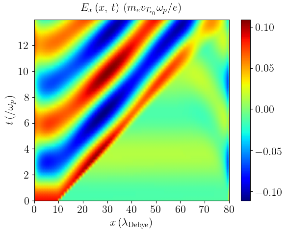

# Summary

ESVM (ElectroStatic Vlasov-Maxwell) is a single species 1D-1V Vlasov-Maxwell Fortran 90 code parallelized with OpenMP that allows for the study of collisionless plasmas. Many finite volume numerical advection schemes @Godunov:1959 are implemented in the code in order to discretize the Vlasov equation, namely :
- the donor-cell scheme i.e. the downwind / upwind scheme @Courant:1952 depending on the advection direction in each phase-space cell, 
- the Lax-Wendroff scheme @LaxWendroff:1960, 
- the Fromm scheme @Fromm:1968,
- the Beam-Warming scheme @BeamWarming:1976,
- the Van Leer scheme @VanLeerIII:1977
- the minmod scheme @Roe:1986, 
- the superbee scheme @Roe:1986 and 
- two Monotonic Upwind-centered Scheme for Conservation Laws (MUSCL) @VanLeerV:1977 schemes MUSCL1 @Crouseilles:2004 and MUSCL2 @Duclous:2009. 

Contrary to the linear second order Lax-Wendroff, Fromm and Beam-Warming schemes, the non-linear second order minmod, superbee, Van Leer and MUSCL schemes make use of a Total Variation Diminishing (TVD) flux limiter with the price of becoming a first order scheme in some phase-space cells to limit the numerical oscillations. The donor-cell scheme is a first order method and has the pros of limiting such eventual oscillations but the cons of being numerically less consistent and more diffusive too. In ESVM, the discretized Vlasov equation is coupled with the self-consistent Maxwell-Gauss equation for the electrostatic field or equivalently with the Maxwell-Ampere equation with Maxwell-Gauss equation computed at the first time step, only. While the 1D second order Maxwell-Gauss solver needs an eventually expensive inversion of a tridiagonal matrix for the computation of the Poisson equation for the electrostatic potential, the 1D Maxwell-Ampere equation solver makes use of the faster second order finite difference Yee scheme @Yee:1966. Both absorbing and periodic boundary conditions for both the particles and the fields are implemented. Python scripts, using the Matplotlib and Numpy packages, are provided to automatically extract and plot the simulation results that are stored in text files. Compilation rules can be easily modified depending on the user compiler preferences using the provided makefile. Well known Plasma Physics academic cases, tools for testing the compilation and tools for checking the simulation parameters are provided. 

# Statement of need

`ESVM` has been developed in order to adapt simulations to specific Plasma Physics problems by chosing the more adequate finite volume numerical advection scheme in order to compute the Vlasov equation phase-space advection derivatives and to chose between computing the Maxwell-Gauss equation or the Maxwell-Ampere equation with Maxwell-Gauss equation computed at the first time step, only. The code aims at beeing used by the open-source Highly Parallel Computing (HPC) Plasma Physics community ranging from under or post-graduate students to teachers and researchers who usually use Particle-In-Cell (PIC) codes @Dawson:1962 to study collisionless plasmas. Indeed, the PIC method may prohibit the study of Plasma Physical processes on large time scales and/or for very dense collisionless plasmas due to the statistical and numerical fluctuations of the computed quantities imposed by the use of a finite number of macroparticles. Also, plasma instabilities naturally develop in PIC codes, seeded by the available fluctuations spatial spectrum k-vector for which the instability growth rate is maximum and some small amplitude Plasma Physical processes may be hidden under the fluctuactions level. Compared to the many open source PIC code such as @Derouillat:2018 and semi-Lagrangian codes, there is no open source finite volume Vlasov codes in the literature that are not based on an expansion method such as @Tzoufras:2011 @Touati:2014 or @Joglekar:2020. In addition, since the Vlasov equation is a conservation equation of the number of particle in the phase-space, using a finite volume method in order to compute the Vlasov equation presents the advantage of allowing for the use of numerical schemes that are numerically flux conserving and/or that ensure the distribution function positivity compared to other numerical methods. ESVM has already been used during courses for under and post-graduate students about the "numerical tools for laser-plasma interaction Physics" and it is currently used for theoretical Plasma Physics investigations.

# Equations computed by ESVM

Plasma ions are assumed to be immobile with a homogeneous density $n_i$ and fully ionized with an electrical charge $Z e$ where $Z$ is the plasma ion atomic number and $e$ the elementary charge. The plasma electron distribution function $f_e (x,v_x,t)$ is computed by ESVM according to the plasma electron 1D-1V Vlasov equation
\begin{equation}
  \label{eq:vlasov1d1v}
  \displaystyle \frac{\partial f_e}{\partial t} (x,v_x,t) + \displaystyle \frac{\partial }{\partial x} \displaystyle \left ( v_x f_e(x,v_x,t) \right ) - \displaystyle \frac{\partial }{\partial v_x} \displaystyle \left ( \displaystyle \frac{e}{m_e} E_x (x,t) f_e (x,v_x,t)\right ) = 0
\end{equation}
that is self-consistently coupled with the Maxwell-Gauss equation 
\begin{equation}
  \label{eq:gauss}
  \displaystyle \frac{\partial E_x}{\partial x} (x,t) = 4 \pi e \displaystyle \left ( Z n_i - n_e (x,t) \right )
\end{equation}
for the electrostatic field $E_x (x,t)$ or, equivalently, self-consistently coupled with the Maxwell-Ampere equation
\begin{equation}
  \label{eq:ampere}
  \displaystyle \frac{\partial E_x }{\partial t } (x,t) = - 4 \pi j_e(x,t) 
\end{equation}
with Maxwell-Gauss equation \autoref{eq:gauss} computed at the simulation start $t=0$ only. Indeed, by integrating the plasma electron Vlasov equation \autoref{eq:vlasov1d1v} over the whole plasma electron velocity space $v_x \in \left [ v_{x,\mathrm{min}},\, v_{x,\mathrm{max}} \right ]$, one gets the hydrodynamic equation of plasma electron number conservation 
\begin{equation}
  \label{eq:continuity}
  \displaystyle \frac{\partial n_e}{\partial t} (x,t) + \displaystyle \frac{\partial }{\partial x} \displaystyle \left ( n_e v_e(x,t) \right ) = 0,
\end{equation}
which, when injected in the time derivative of Maxwell-Gauss equation \autoref{eq:gauss}, provides the Maxwell-Ampere equation \autoref{eq:ampere} if Maxwell-Gauss equation \autoref{eq:gauss} is verified at the simulation start t=0. Here, we have noted 
\begin{equation}
  \label{eq:density}
  n_e (x,t) = \displaystyle \int_{v_{x,\mathrm{min}}}^{v_{x,\mathrm{max}}} f_e (x,v_x,t) \, d v_x,
\end{equation}
\begin{equation}
  \label{eq:mean_velocity}
  v_e (x,t) = \displaystyle\frac{1}{n_e (x,t)} \displaystyle \int_{v_{x,\mathrm{min}}}^{v_{x,\mathrm{max}}} f_e (x,v_x,t) v_x \, d v_x
\end{equation}
and
\begin{equation}
  \label{eq:current}
  j_e(x,t) = -e n_e (x,t) v_e (x,t)
\end{equation}
the plasma electron density, mean velocity and electrical charge current, respectively. ESVM also computes the plasma electron thermal velocity $v_{T_e} (x,t)$ defined according to the plasma electron internal energy density
\begin{equation}
  \label{eq:internal_energy}
  u_{T_e} (x,t) = n_e (x,t) m_e {v_{T_e} (x,t)}^2  = m_e  \displaystyle \int_{v_{x,\mathrm{min}}}^{v_{x,\mathrm{max}}} f_e (x,v_x,t) {\displaystyle \left ( v_x - v_e (x,t) \right )}^2 \, d v_x.
\end{equation}
For example, in plasmas at local Maxwell-Boltzmann equilibrium, $v_{T_e} (x,t) = \displaystyle \sqrt{k_B T_e (x,t) / m_e}$ where $k_B$ is the Boltzmann constant, $T_e(x,t)$ is the local electron temperature and $m_e$ the electron mass. Maxwell-Gauss equation \autoref{eq:gauss} is computed by using the electrostatic potential definition 
\begin{equation}
  \label{eq:potential}
  \displaystyle \frac{\partial \Phi}{\partial x} (x,t) = - E_x (x,t)
\end{equation}
that gives the Poisson equation
\begin{equation}
  \label{eq:poisson}
  \displaystyle \frac{\partial^2 \Phi}{\partial x^2} (x,t) = - 4 \pi e \displaystyle \left ( Z n_i - n_e (x,t) \right )
\end{equation}
for the electrostatic potential $\Phi$ when injected in the Maxwell-Gauss equation \autoref{eq:gauss}.
When the simulation is running, ESVM stores at every time steps and displays on the terminal at every dumped time steps $t_d$ the total plasma electron internal and kinetic energy area density and the total electrostatic energy area density in the simulation box $x \in \left [ x_{\mathrm{min}},\, x_{\mathrm{max}} \right ]$
\begin{equation}
  \label{eq:total_internal_energy}
  U_{T_e} (t_d) = \displaystyle \int_{x_{\mathrm{min}}}^{x_{\mathrm{max}}} u_{T_e} (x,t_d) \, d x,
\end{equation}
\begin{equation}
\label{eq:total_kinetic_energy}
U_{K_e} (t_d) = \displaystyle \int_{x_{\mathrm{min}}}^{x_{\mathrm{max}}} n_e (x,t) \displaystyle \frac{m_e {v_e (x,t_d)}^2}{2}  \,  d x
\end{equation}
and
\begin{equation}
  \label{eq:total_electrostatic_energy}
  U_{E_x} (t_d) = \displaystyle \int_{x_{\mathrm{min}}}^{x_{\mathrm{max}}} \displaystyle \frac{{E_x (x,t_d)}^2}{8 \pi} \, d x,
\end{equation}
respectively as well as the total energy area density
\begin{equation}
  U_{\mathrm{tot}} (t_d) = U_{T_e} (t_d)+ U_{K_e} (t_d) + U_{E_x} (t_d)
\end{equation}
in order to check the energy conservation in the simulation.

# ESVM units

The code units consist in the commonly used electrostatic units : the electron mass $m_e$ for masses, the elementary charge $e$ for electrical charges, the inverse of the Langmuir plasma electron angular frequency $\omega_{p} = \displaystyle \sqrt{ 4 \pi Z n_i e^2 / m_e}$ for times, the Debye electron screening length $\lambda_{\mathrm{Debye}} = v_{T_e} / \omega_{p}$ and the constant ion density $n_i$ for spatial densities. The resulting normalized electrostatic field and electron distribution function consequently reads $\underline{E_x} = e E_x / m_e \omega_{p} v_{T}$ and $\underline{f_e} = f_e v_{T_e} / n_i$, respectively.

# ESVM numerical stability

The spatial grid cells should be chosen lower than the Debye length $\Delta x < \lambda_{\mathrm{Debye}}$ for the simulation to be Physical. $v_{x,\mathrm{min}}$ and $v_{x,\mathrm{max}}$ should be chosen sufficiently large $|v_{x,\mathrm{min}/\mathrm{max}}| \gg v_{T_e}$ in such a way that there is no plasma electrons outside the simulation velocity space during the whole simulation. The simulation velocity bin size should be chosen lower than the thermal electron velocity $\Delta v_x < v_{T_e}$ (which can also be defined as the standard deviation velocity of plasma electrons if the plasma is not at Maxwell-Boltzmann equilibrium) and also sufficiently small to capture the desired Physics. The CFL stability criterium (from the name of its finder R. Courant, K. Friedrichs and H. Lewy @Courant:1928) is taken into account inside the code so that the user just needs to specify in the input deck the scalar parameter $\mathrm{cfl} < 1$ such that the normalized simulation time step reads
\begin{equation}
\underline{\Delta t}_n = \mathrm{cfl} \times F^n(\underline{\Delta x}, \underline{\Delta v}_x ) < F^n(\underline{\Delta x}, \underline{\Delta v}_x)
\end{equation}
at the time step $\underline{t}_n = \sum_{m=1}^{n} \underline{\Delta t}_m$ at time iteration $n$ where $F^n(\underline{\Delta x}, \underline{\Delta v}_x)$ depends on the chosen numerical scheme. For example, if one notes
\begin{equation}
  \label{eq:vol_def}
\underline{f_e}^{n,i} = \displaystyle \frac{1}{\underline{\Delta x} } \displaystyle \int_{\underline{x}_{i-1/2}}^{\underline{x}_{i+1/2}} \underline{f_e} \left(\underline{x},\,\underline{t}_n\right)\, d \underline{x}
\end{equation}
the electron distribution function finite volume at the spatial location $\underline{x}_i$ located in between $\underline{x}_{i-1/2} = \underline{x}_{i} - \underline{\Delta x}/2$ and $\underline{x}_{i+1/2} = \underline{x}_{i} + \underline{\Delta x}/2$ and one considers the Lax-Wendroff method to compute the advection 
\begin{equation}
  \label{eq:advection}
  \displaystyle \frac{\partial \underline{f_e}}{\partial \underline{t}} + \underline{v_x} \displaystyle \frac{\partial \underline{f_e}}{\partial \underline{x} } = 0
\end{equation}
of plasma electrons along the spatial $\underline{x}$-axis in the phase-space, the numerical scheme reads
\begin{equation}
  \label{eq:LaxWendroff}
  {\left [ \displaystyle \frac{\underline{f_e}^{n+1} - \underline{f_e}^{n} }{ \underline{\Delta t} } \right ]}^i + \underline{v_x} {\left [ \displaystyle \frac{\underline{F_x}^{i+1/2} - \underline{F_x}^{i-1/2} }{ \underline{\Delta x} } \right ]}^n = 0
\end{equation}
where the plasma electron fluxes across the volume sections located at $\underline{x}_{i\pm1/2}$ are given by
\begin{equation}
  \label{eq:LaxWendroff_fluxes_plus}
  \underline{F_x}^{n,i+1/2} = \displaystyle \frac{\underline{f_e}^{n,i+1} + \underline{f_e}^{n,i}}{2} - \displaystyle \frac{\underline{v_x} \underline{\Delta t}}{\underline{\Delta x}} \displaystyle \frac{\underline{f_e}^{n,i+1} - \underline{f_e}^{n,i}}{2}
\end{equation}
and
\begin{equation}
  \label{eq:LaxWendroff_fluxes_minus}
  \underline{F_x} ^{n,i-1/2} = \displaystyle \frac{\underline{f_e}^{n,i} + \underline{f_e}^{n,i-1}}{2} - \displaystyle \frac{\underline{v_x} \underline{\Delta t}}{\underline{\Delta x}} \displaystyle \frac{\underline{f_e}^{n,i} - \underline{f_e}^{n,i-1}}{2}.
\end{equation}
According to the Taylor expansion of $\underline{f_e}^{n,i+i}$, $\underline{f_e}^{n,i-i}$ and $\underline{f_e}^{n+1,i}$ up to the third order in space and time, one can check the Lax-Wendroff numerical consistency error is indeed of second order :
\begin{equation}
  \label{eq:LaxWendroff_error}
  \begin{array}{lll}
  \underline{\epsilon}^{n,i} &=& {\left [ \displaystyle \frac{\underline{f_e}^{n+1} - \underline{f_e}^{n} }{ \underline{\Delta t} } \right ]}^i + \underline{v_x} {\left [ \displaystyle \frac{\underline{F_x}^{i+1/2} - \underline{F_x}^{i-1/2} }{ \underline{\Delta x} } \right ]}^n - \displaystyle \left (  {\left . \displaystyle \frac{\partial \underline{f_e} }{\partial \underline{t}} \right |}^{n,i} + \underline{v_x}  {\left . \displaystyle \frac{\partial \underline{f_e} }{\partial \underline{x}} \right |}^{n,i} \right )
  \cr &=& \displaystyle \frac{ {\underline{\Delta t}}^2 }{6} {\left . \displaystyle \frac{\partial^3 \underline{f_e} }{\partial \underline{t}^3} \right |}^{n,i}  + \underline{v_x} \displaystyle \frac{ {\underline{\Delta x}}^2 }{6}  {\left . \displaystyle \frac{\partial^3 \underline{f_e} }{\partial \underline{x}^3} \right |}^{n,i} + O\left ( {\underline{\Delta t}}^3 + {\underline{\Delta x}}^3 + \underline{\Delta t} {\underline{\Delta x}}^2\right ).
  \end{array}
\end{equation}
By using the Von Neumann stability analysis, assuming periodic boundary conditions for simplicity and noting
\begin{equation}
  \label{eq:VonNeumann}
   \widehat{\underline{f_e}}^n(\underline{k}^p) = \displaystyle \frac{1}{ N_x } \displaystyle \sum_{i=1}^{N_x} \underline{f_e}^{i,n} \exp{\left (-  j \underline{k}^p \underline{x}_i \right )} \Leftrightarrow \underline{f_e}^{n,i}  = \displaystyle \sum_{p=1}^{N_x} \widehat{\underline{f_e}}^n(\underline{k}^p)  \exp{\left ( j \underline{k}^p \underline{x}_i \right )}
\end{equation}
with $j^2=-1$, $N_x=1+(\underline{x}_{\mathrm{max}}-\underline{x}_{\mathrm{min}})/\underline{\Delta x}$ the number of spatial grid points and $\underline{k}^p = 2 \pi (p-1) / (\underline{x}_{\mathrm{max}}-\underline{x}_{\mathrm{min}})$ the discrete Fourier mode, one gets by injecting \autoref{eq:VonNeumann} in \autoref{eq:LaxWendroff}
\begin{equation}
\displaystyle \frac{ \widehat{\underline{f_e}}^{n+1} (\underline{k}^p) }{  \widehat{\underline{f_e}}^{n} (\underline{k}^p) } =  1 - \displaystyle \frac{\underline{v_x} \underline{\Delta t}}{\underline{\Delta x} } j \sin{\left ( \underline{k}^p \underline{\Delta x} \right )} + { \left (  \displaystyle \frac{ \underline{v_x} \underline{\Delta t} }{ \underline{\Delta x} } \right )}^2 \left [ \cos{\left ( \underline{k}^p \underline{\Delta x} \right )}   -1 \right ]
\end{equation}
for each term $p$ of the series. It implies the numerical scheme is stable, meaning $| \widehat{\underline{f_e}}^{n+1} (\underline{k}^p) /   \widehat{\underline{f_e}}^{n} (\underline{k}^p) | < 1$, if ${| \widehat{\underline{f_e}}^{n+1} (\underline{k}^p) /   \widehat{\underline{f_e}}^{n} (\underline{k}^p) |}^2 < 1$ and consequently if $\underline{v_x} \underline{\Delta t} / \underline{\Delta x} <1$. Performing the same reasoning when discretizing also the velocity space $\underline{v}_{x}^\ell = \underline{v}_{x,\mathrm{min}} + (\ell-1 ) \underline{\Delta v}_x$ with $N_{v_x} = 1 + (\underline{v}_{x,\mathrm{max}}-\underline{v}_{x,\mathrm{min}}) / \underline{\Delta v}_x$ velocity grid points and considering in addition the advection term of plasma electrons along the $\underline{v_x}$-axis in the velocity space for computing the Vlasov equation \autoref{eq:vlasov1d1v} for each numerical scheme  implemented in ESVM, one finds (sometimes empirically when analytically too complex) that
\begin{equation}
  \label{CFL}
  F^n(\underline{\Delta x}, \underline{\Delta v}_x) = \displaystyle \frac{1/2}{ \displaystyle \frac{ \underset{\ell \in [1,N_{v_x}]}{\mathrm{max}}\{ \underline{v}_x^\ell \} }{ \underline{\Delta x} } + \displaystyle \frac{ \underset{i \in [1,N_x]}{\mathrm{max}}\{ \underline{E}_x^{n,i} \} }{ \underline{\Delta v}_x } }.
\end{equation}
is a sufficient condition for all numerical schemes implemented in ESVM to be stable.

# Provided academic cases

Four well-known Plasma Physics academic cases are provided with ESVM :
1) the emission of an electrostatic wakefield by a Gaussian (in space and velocity-space) electron beam drifting at a mean velocity higher than the plasma electron thermal velocity; cf. \autoref{fig:electrostatic-wakefield}
2) the linear Landau damping of an electrostatic wave; cf. \autoref{fig:linear-landau-damping}, 
3) the non-linear Landau damping of an electrostatic wave; cf. \autoref{fig:non-linear-landau-damping} and 
3) the two-stream instability; cf. \autoref{fig:two-stream-instability}.

For each Academic case, an example of input deck is provided together with the corresponding simulation result plots that the code typically generates. For 1), 2) and 3), the simulation is initialized assuming a non-drifting collisionless plasma at Maxwell-Boltzmann equilibrium 
\begin{equation}
  \label{MaxwellBoltzmannEquilibrium}
  \displaystyle \left \{
  \begin{array}{l}
      f_e^{(0)} (x,t=0) = \displaystyle \frac{Z n_i}{ \displaystyle \sqrt{ 2 \pi {v_{T_e}}^2 } } \exp{ \displaystyle \left [ - \displaystyle \frac{ v_x^2 }{ 2 {v_{T_e}}^2 } \right ] }
  \cr E_x^{(0)} (x,t=0) = 0
  \end{array} \right .
\end{equation}
that is perturbed with a small perturbation 
\begin{equation}
  \delta f_e (x,t=0)= \displaystyle \frac{ A }{ 2 \pi \delta x \delta v } \exp{ \displaystyle \left [ - \displaystyle \frac{ {(x-x_d)}^2 }{ 2 {\delta x}^2 } \right ] } \exp{ \displaystyle \left [ - \displaystyle \frac{ {(v_x-v_d)}^2 }{ 2 {\delta v}^2 } \right ] },
\end{equation}
consisting of an electron beam located at $x_d = x_{\mathrm{min}} + ( x_{\mathrm{max}}-x_{\mathrm{min}} )/8$ with a spatial size $\delta x = \lambda_{\mathrm{Debye}} / 4$ drifting at a velocity $v_d$ with a velocity standard deviation $\delta v = v_{T_e} / 40$ at the simulation start for 1), and a small perturbation 
\begin{equation}
  \delta E_x (x,t < \delta t)= A \sin{ \displaystyle \left ( \omega_0 t - k x \right ) }
\end{equation}
during a short time interval $\delta t = 6 \pi / \omega_0$ after the simulation start $t=0$ for 2) and 3) where $A \ll 1$, $v_d > v_{T_e}$, $\omega_0$ and $k$ are the perturbation amplitude, drift velocity, angular temporal frequency and angular spatial frequency, respectively, that the user can choose when filling the input-deck, such that
\begin{equation}
  \displaystyle \left \{
  \begin{array}{ccccc}
      f_e (x,t) &=& f_e^{(0)} (x,t) &+& \delta f_e (x,t)
  \cr E_x (x,t) &=& E_x^{(0)} (x,t) &+& \delta E_x (x,t)
  \end{array} \right . \, \mathrm{with}\, \left | \delta f_e (x,t) \right | \ll f_e^{(0)} (x,t)
\end{equation}
during the linear stage of the simulation. In order to highlight how such ESVM simulation result can be checked, we will only detail here the derivation of analytical estimates related with the provided academic case 3) and recommend the reader the reference texbooks @LandauLifshitz:1981 and @GaleevSagdeev:1969 as well as @Decyk:1987 in order to check the provided academic case simulation results 1), 2) and 4), respectively.

# Perspectives

It is planned in a near future to :
- provide another Plasma Physics academic simulation about one BGK (from the name of its founder I. B. Bernstein, J. M. Greene and M. D. Kruskal) non linear solution @BernsteinGreenKruskal:1957
- provide a second Plasma Physics academic simulation about Plasma wave echo @Gould:1967
- implement high order Weighted Essentially Non-Oscillatory (WENO) advection schemes @Liu:1994
- compute the plasma ion Vlasov equation to allow for the ions to be mobile 
- extend the code to relativistic electromagnetic 2D-2V and 1D-3V phase-space electromagnetic plasma simulations
- implement its MPI parallelization
- implement its vectorization
- store the simulation results in hdf5 files instead of text files
- implement the Perfectly Matched Layer (PML) technique @Berenger:1994 to absorb the electromagnetic fields at the spatial simulation box boundaries
- implement a relativistic BGK (from the name of its founder P. L. Bhatnagar, E. P. Gross  and M. Krook) collision operator @BhatnagarGrossKrook:1954
- implement the Belyaev-Budker relativistic collision operator @BelaievBudker:1957 using the Braams-Karney relativistic extension of Rosenbluth potentials @BraamsKarney:1987
- deploy the code to GPU architectures.

# Figures

Electrostatic wakefield test case : Electrostatic wakefield :

Linear Landau damping test case : Electrostatic field energy and Plasma electron kinetic energy versus time :

Non Linear Landau damping test case : Plasma electrons phase-space :

Two stream instability test case : Plasma electrons phase-space :

# References
