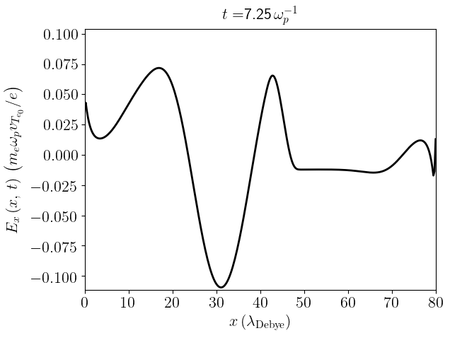

# Summary

ESVM (ElectroStatic Vlasov-Maxwell) is a Vlasov-Maxwell Fortran 90 code and parallelized using OpenMP allowing for the study of collisionless plasmas . The different finite volume numerical advection schemes @Godunov:1959 implemented in the code in order to discretize the Vlasov equation are the :
- donor-cell scheme i.e. the downwind / upwind scheme @Courant:1952 depending on the advection direction in each phase-space cell, 
- Lax-Wendroff scheme @LaxWendroff:1960, 
- Fromm scheme @Fromm:1968,
- Beam-Warming scheme @BeamWarming:1976,
- Van Leer scheme @VanLeer:1977
- minmod scheme @Roe:1986, 
- superbee scheme @Roe:1986 and 
- two Monotonic Upwind-centered Scheme for Conservation Laws (MUSCL) schemes MUSCL1 and MUSCL2. 

Contrary to the linear second order Lax-Wendroff, Fromm and Beam-Warming schemes, the non-linear second order minmod, superbee, Van Leer and MUSCL schemes make use of a Total Variation Diminishing (TVD) flux limiter with the price of becoming a first order scheme in some phase-space cells to limit numerical oscillations. The donor-cell scheme is a first order scheme. It has the pros of naturally limiting such eventual oscillations but the cons of being highly numerically diffusive so. In ESVM, the discretized Vlasov equation is coupled with the self-consistent Maxwell-Gauss equation for the electrostatic field or equivalently with the Maxwell-Ampere equation with Poisson equation computed at the first time step. While the 1D discretized Poisson equation needs the inversion of a triangular matrix, the second one makes use of the faster second order finite difference Yee scheme @Yee:1966. Python scripts, using the Matplotlib and Numpy packages, are provided to automatically extract and plot the simulation results that are stored in text files. Compilation rules can be easily modified depending on the user compiler preferences using the provided makefile. 

# Statement of need

`ESVM` has been developed in order to adapt simulations to specific Plasma Physics problems by chosing the more adequate finite volume numerical advection scheme in order to compute the Vlasov equation phase-space advection derivatives and to chose between computing the Poisson equation versus computing the Maxwell-Ampere equation (with Poisson equation computed at the first time step only). The code aims at beeing used by the open-source Highly Parallel Computing (HPC) Plasma Physics community ranging from under and post-graduate students to teachers and theoretical researchers who usually use Particle-In-Cell (PIC) codes @Dawson:1962 to study collisionless plasmas. However, the PIC method, that can be seen as a Lagrangian Vlasov equation solver, may prohibit the study of Physical processes on large time scales and/or for dense collisionless plasmas due to the fluctuations of computed quantities imposed by the use of a finite number of particles. Compared to open source PIC and semi-Lagrangian codes, there is not an abundant number of open source Eulerian Vlasov codes in the literature that are not based on an expansion method @Tzoufras:2011 @Touati:2014 @Joglekar:2020. Finally, Vlasov equation is a conservation equation of the number of particle in the phase-space. Therefore, using a finite volume method in order to compute it has the advantage of allowing the use of numerical schemes that are numerically flux conserving compared to other numerical methods. Four well-known academic Plasma Physics cases are provided :
1) the linear Landau damping of an electrostatic wave; cf. \autoref{fig:linear-landau-damping}, 
2) the non-linear Landau damping of an electrostatic wave; cf. \autoref{fig:non-linear-landau-damping} and \autoref{fig:non-linear-landau-damping-2}, 
3) the two-stream instability; cf. \autoref{fig:two-stream-instability} and 
4) the emission of an electrostatic wakefield  by a Gaussian (in space and velocity-space) electron drifting at a mean velocity higher than the plasma electron thermal velocity; cf. \autoref{fig:electrostatic-wakefield}. For each Academic case, an example of input deck is provided together with the corresponding simulation result plots that the code typically generates.

# Mathematics

The equations computed explicitely by the code are the 1D-1V Vlasov equation for plasma electrons (ions are assumed to be fully ionized with an electrical charge $Z e$, $Z$ being the ion atomic number, and that they remain immobile with a density $n_i$): 
\begin{equation}
\label{eq:vlasov1d1v}
\displaystyle \frac{\partial f_e}{\partial t} (x,v_x,t) + \displaystyle \frac{\partial }{\partial x} \displaystyle \left ( v_x f_e(x,v_x,t) \right ) - \displaystyle \frac{\partial }{\partial v_x} \displaystyle \left ( \displaystyle \frac{e}{m_e} E_x (x,t) f_e (x,v_x,t)\right ) = 0
\end{equation}
and the coupled Poisson equation for the electrostatic field 
$$
\displaystyle \left \{ \begin{array}{l}
    \displaystyle \frac{\partial \Phi}{\partial x} (x,t) = - E_x (x,t)
\cr \displaystyle \frac{\partial E_x}{\partial x} (x,t) = 4 \pi \displaystyle \left ( Z e n_i - e \displaystyle \int_{-\infty}^\infty f_e (x,v_x,t) \, d v_x \right )
\end{array} \right .
$$
\begin{equation}
\label{eq:poisson}
\Rightarrow \displaystyle \frac{\partial^2 \Phi}{\partial x^2} (x,t) = - 4 \pi \displaystyle \left ( Z e n_i - e \displaystyle \int_{-\infty}^\infty f_e (x,v_x,t) \, d v_x\right )
\end{equation}
or equivalently, the coupled Maxwell-Ampere equation with Poisson equation computed at $t=0$ only
\begin{equation}
\label{eq:ampere}
\displaystyle \left \{ \begin{array}{l}
    \displaystyle \frac{\partial^2 \Phi}{\partial x^2} (x,t=0) = - 4 \pi \displaystyle \left ( Z e n_i - e \displaystyle \int_{-\infty}^\infty f_e (x,v_x,t=0) \, d v_x\right )
\cr  \displaystyle \frac{\partial E_x }{\partial t } (x,t) = 4 \pi e \displaystyle \int_{-\infty}^\infty f_e (x,v_x,t) v_x \, d v_x
\end{array} \right .
\end{equation}

The code units consist in the commonly used electrostatic units : the electron mass $m_e$ for masses, the elementary charge $e$ for electrical charges, the inverse of the Langmuir plasma electron angular frequency $\omega_{p} = \displaystyle \sqrt{ 4 \pi Z n_i e^2 / m_e}$ for times, the Debye electron screening length $\lambda_{\mathrm{Debye}} = \displaystyle \sqrt{k_B T_e / 4 \pi Z n_i e^2}$ where $k_B$ is the Boltzmann constant and $T_e$ the plasma electron temperature (and therefore the thermal plasma electron velocity $v_{T} = \lambda_{\mathrm{Debye}} \omega_{p}$ for velocities) and the constant ion density $n_i$ for densities ($\underline{f}_e = f_e v_{T_e} / n_i$). The resulting electrostatic field unit consequently reads $\underline{E}_x = e E_x / m_e \omega_{p} v_{T}$.

Obviously, the spatial grid cells $\Delta x$ must be chosen lower than the Debye length for the simulations to be Physical, the 
size $\Delta v_x$ and extrema $[v_{\mathrm{min}},v_{\mathrm{max}}]$ in agreement with the considered Plasma Physics problem. The CFL stability criterium is taken into account inside the code so that the user just needs to specify in the input deck the scalar parameter $\mathrm{cfl}$ such that the simulation time step respects
\begin{equation}
\Delta t = \mathrm{cfl} \times F(\Delta x, \Delta v_x) < F(\Delta x, \Delta v_x)
\end{equation}
where $F(\Delta x, \Delta v_x)$ depends on the chosen numerical scheme and is implemented in a code subroutine.

# Perspectives

It is planned in a near future to :
- extend the code to relativistic 2D-2V and 1D-3V phase-space electromagnetic plasma simulations
- implement the Perfectly Matched Layer technique for Electromagnetic Fields absorption at the spatial simulation box boundaries
- implement its MPI parallelization
- implement a relativistic BGK collision operator
- implement the Belyaev-Budker relativistic collision operator
- deploy the code to GPU architectures.

# Figures

The following figures have been directly obtained using the provided input decks corresponding to the previously mentioned well known academic Plasma Physics problems. Except for the non-linear Landau damping problem for which the non-linear theory should be used in order to check the simulation results, all other simulation results can be checked by solving analytically the equations computed by the codes, linearized around the considered equilibrium distribution function and introducing the considered small perturbation. In all cases, a large number of Plasma Physics papers and textbooks can corroborate them.

Linear Landau damping test case : Electrostatic field energy and Plasma electron kinetic energy versus time :

Non-linear Landau damping test case : Electrostatic field energy and Plasma electron kinetic energy versus time :

Non Linear Landau damping test case : Plasma electrons phase-space :

Two stream instability test case : Plasma electrons phase-space :

Electrostatic wakefield test case : Electrostatic wakefield :

# References
