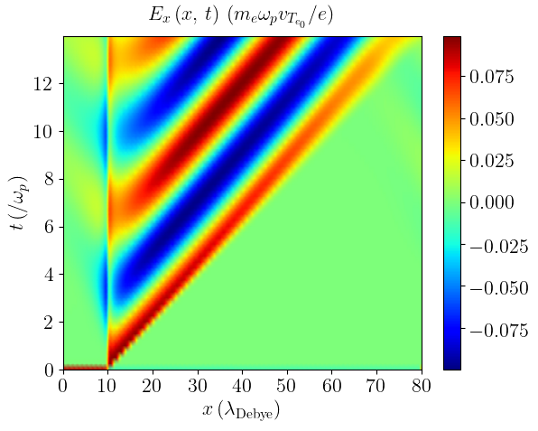
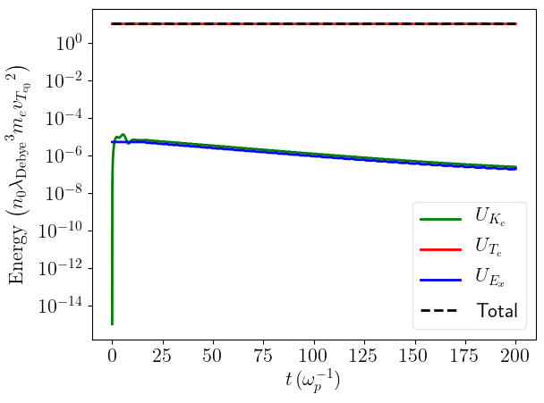
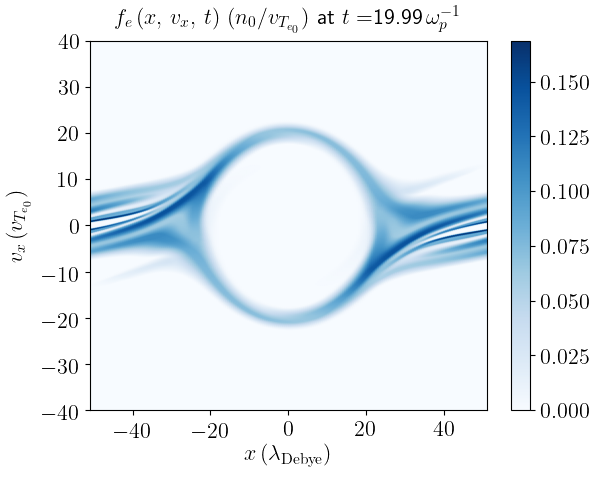
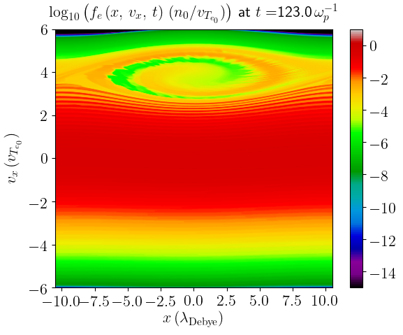

<!-- [](https://fortran-lang.org/) -->
<!-- [](https://www.gnu.org/software/make/) -->
<!-- [](https://www.gnu.org/software/bash/) -->
<!-- [](https://www.python.org/) -->
<!-- [](https://numpy.org/) -->
<!-- [](https://matplotlib.org/stable/index.html#) -->
<!-- [](https://www.latex-project.org//) -->
[](https://www.gnu.org/licenses/gpl-3.0)
[](https://joss.theoj.org/papers/d0f6a6298710d69b63a8a62d843f8f88)
[](https://github.com/michaeltouati/ESVM/issues)
[](https://github.com/michaeltouati/ESVM/pulls)
[](https://github.com/MShawon/github-clone-count-badge)
<!-- [](https://github.com/michaeltouati/ESVM/issues) -->
<!-- [](https://github.com/michaeltouati/ESVM/pulls) -->
<!-- [](https://github.com/michaeltouati/ESVM/releases) -->
<!-- [](https://github.com/michaeltouati/ESVM/watchers) -->
<!-- [](https://github.com/michaeltouati/ESVM/stargazers) -->
<!-- [](https://github.com/michaeltouati/ESVM/network/members) -->
<!--  -->

## Written by Michaël J TOUATI

[ESVM](https://github.com/michaeltouati/ESVM) (ElectroStatic Vlasov-Maxwell) is a Vlasov-Maxwell [Fortran 95](https://fortran-lang.org/) standard-compliant code, parallelized with OpenMP and using Python 3 for post-processing, that allows for the study of collisionless plasmas. Vlasov equation is coupled with the self-consistent Maxwell-Gauss equation, or equivalently with the Maxwell-Ampere equation with Maxwell-Gauss equation computed at the first time step, only. Both absorbing and periodic boundary conditions for both the particles and the fields are implemented. More pieces of information can be found in the [esvm.pdf](https://github.com/michaeltouati/ESVM/blob/master/esvm.pdf) peer-reviewed article draft. [Python](https://www.python.org/) scripts, using the [Matplotlib](https://matplotlib.org/stable/index.html#) and [Numpy](https://numpy.org/) packages, are provided to automatically extract and plot the stored simulation results. The simulation parameters are described in the [input-deck](https://github.com/michaeltouati/ESVM/blob/master/input-deck) and they can be modified without having to recompile the code. Compilation rules can be modified in the [makefile](https://github.com/michaeltouati/ESVM/blob/master/makefile) depending on the user compiler preferences. Classical Plasma Physics academic case simulations that need less than one CPUxhour each, tools for testing the compilation of the code and tools for checking the simulation parameters are provided.

# Simulation plot examples

<p align="center">
  
  
</p>

<p align="center">
  
  
</p>

# Code units

The code units consist in the commonly used electrostatic units : the electron mass for masses, the elementary charge for electrical charges, the inverse of the Langmuir plasma electron angular frequency for times, the Debye electron screening length for spaces and the average plasma electron density for spatial densities. The initial plasma electron velocity distribution standard deviation is therefore an important unit parameter of normalization since it fixes indirectly the spatial unit.

# Compiling the code

Modify the [makefile](https://github.com/michaeltouati/ESVM/blob/master/makefile) as a function of the wished compilation options and the Fortran compiler installed on your computer and then type

```sh
make
```
The compilation can be tested by typing
```sh
make test
```
The tests consist in comparing file1 and file2 where :
* file1 is one test simulation terminal output performed with an input deck located in the directory 'test-cases/Tests/' and
* file2 is the terminal output of the corresponding simulation already performed by the developper also located in 'test-cases/Tests/'.

# Running a simulation

Fill the wished [input-deck](https://github.com/michaeltouati/ESVM/blob/master/input-deck) (all parameters are described inside), eventually check them by typing
```sh
./check-input-deck
```
or
```sh
make check
```
and then type
```sh
./esvm
```
or
```sh
make run
```
to run the simulation.

# Plotting the simulation results

All simulation results are stored in files located in the directory 'results'. 
Python scripts allowing to extract and plot the simulation results are located in the directory 'sources/plot'.
They can be used by simply typing :
```sh
make plot
```
to plot all the results, even when the simulation is still running. The resulting plots will be stored in the directory 'figures'. It can also be plotted separately :
- the energies scalar plots by typing :
```sh
make plot_energies
```
or
```sh
python3 sources/plot/plot_logfe.py
```
- the 1D plasma electron hydrodynamic moments space-time density maps by typing :
```sh
make plot_hydro2D
```
or
```sh
python3 sources/plot/plot_hydro2D.py
```
- the 1D plasma electron hydrodynamic moments scalar plots by typing : 
```sh
make plot_hydro1D
```
or
```sh
python3 sources/plot/plot_hydro1D.py
```
- or the 1D1V plasma electron distribution function phase-space density maps by typing :
```sh
make plot_fe
```
or
```sh
python3 sources/plot/plot_fe.py
```
If you need to plot the 1D1V plasma electron distribution function phase-space density maps in logarithmic scale instead, type :
```sh
make plot_logfe
```
or
```sh
python3 sources/plot/plot_logfe.py
```

# Cleaning the directory

If you want to remove from the [ESVM](https://github.com/michaeltouati/ESVM) directory :
- the compilation files and executables, type :
```sh
make distclean
```
- the directory 'figures' containing all simulations results plots, type :
```sh
make figclean
```
- the directory 'results' containing all simulations results data files, type :
```sh
make resclean
```
- the three previous ones, type :
```sh
make clean
```
Be careful, the three latters will remove all simulations results and or figures. Store them elsewhere if you don't want to lose them.

# License
[ESVM](https://github.com/michaeltouati/ESVM) is covered by the [GPLv3](https://www.gnu.org/licenses/gpl-3.0.en.html) license. 
